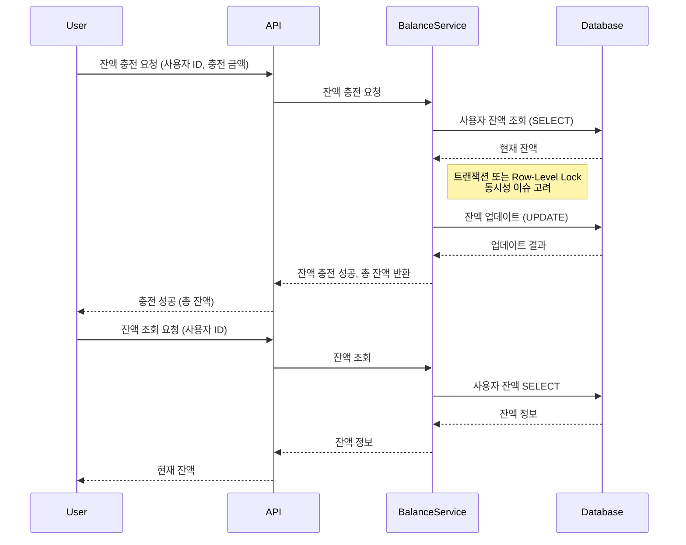
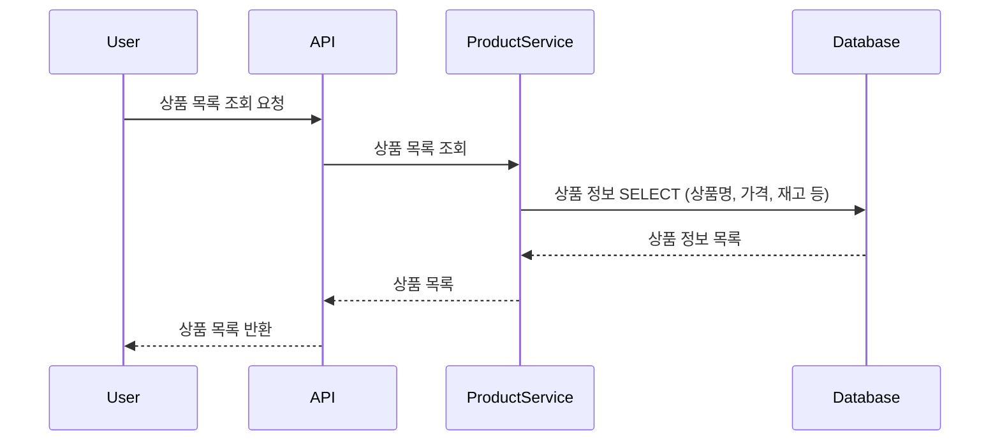
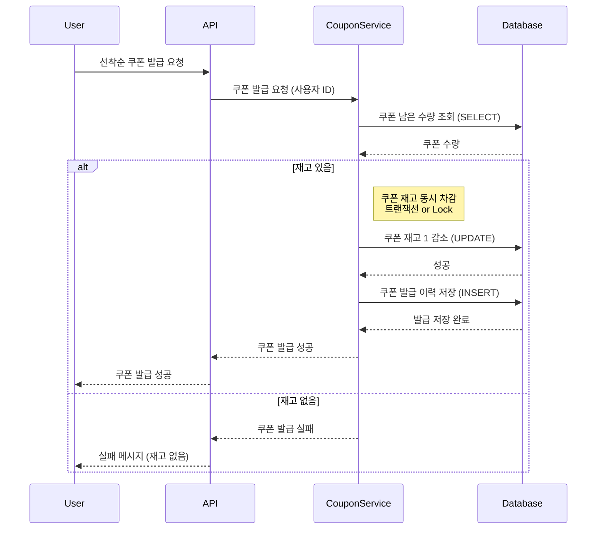
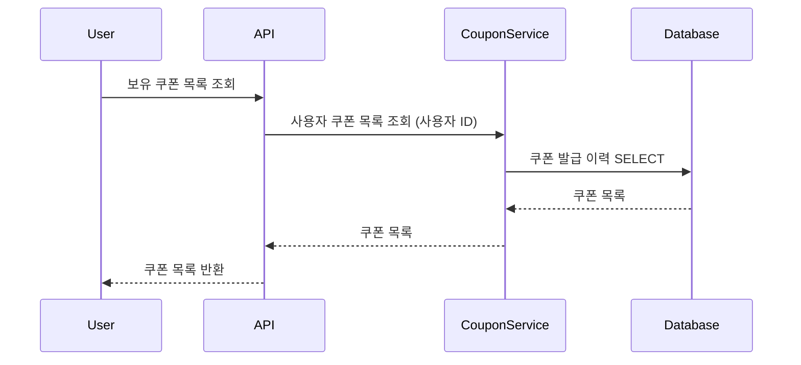
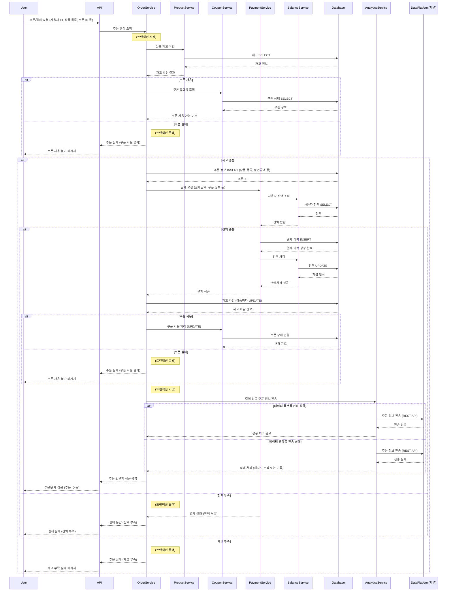
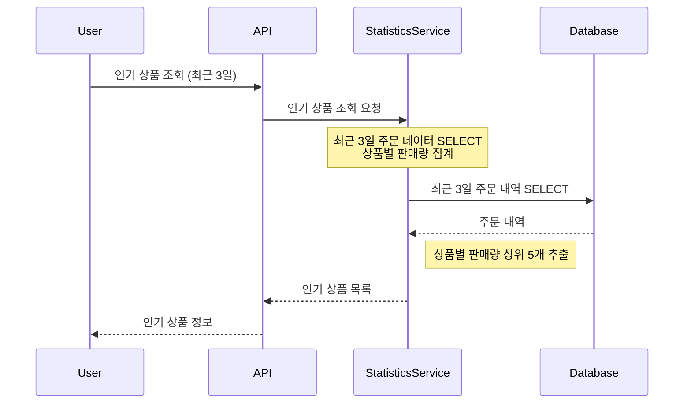

# e-커머스 서비스 - 시퀀스 다이어그램

## 1. 잔액 충전 / 조회

---

- **BalanceService**에서 잔액을 관리하며, DB 트랜잭션/Lock을 통해 동시성 이슈를 방지합니다.
- 충전 후 최종 잔액을 반환합니다.
- 조회는 단순 Select로 사용자의 잔액을 전달합니다.

 

## 2. 상품 조회

---

- **ProductService**가 상품 목록을 DB에서 조회하여 반환합니다.
- 사용자에게 상품명, 가격, 재고 등의 정보를 보여줍니다.
- 재고는 주문 시점에 다시 한 번 확인이 필요합니다.

 

## 3. 선착순 쿠폰 발급 / 보유 쿠폰 조회

---

### 3-1) 선착순 쿠폰 발급

- **CouponService**가 쿠폰 재고를 확인하고, 있을 경우 1 감소 후 발급 이력을 저장합니다.
- 동시에 여러 사용자가 요청할 수 있으므로 DB 트랜잭션/Lock을 통해 선착순 로직을 안전하게 처리해야 합니다.

 

### 3-2) 보유 쿠폰 조회

#### 이벤트 시퀀스 다이어그램

- 사용자 ID로 쿠폰 테이블(또는 발급 이력 테이블)에서 보유 중인 쿠폰 목록을 조회합니다.
- 유효 기간이나 사용 여부 등은 추가 로직으로 확장 가능.

 

## 4. 주문 / 결제

---

- **OrderService**가 트랜잭션을 관리하며 쿠폰 유효성 → 재고 확인 → 주문 생성 → 결제 로직을 순차적으로 진행합니다.
- 결제에는 **PaymentService**와 **BalanceService**가 관여하며, 잔액 부족 시 트랜잭션을 롤백합니다.
- 최종적으로 재고 차감, 쿠폰 사용 처리까지 한 번에 처리한 뒤, **AnalyticsService**로 데이터 플랫폼으로 주문 정보를 전송할 수 있습니다.

 

## 5. 인기 상품 조회

---

- **StatisticsService**(또는 다른 이름)가 최근 3일간 주문 테이블을 조회하여 상품별 판매량을 계산합니다.
- 상위 5개 상품을 선정해 사용자에게 반환합니다.
- 대량 트래픽이 예상될 시 Materialized View 나 비정규화된 특수 테이블을 고려해야합니다. 우선, 단순 SELECT 후 계산으로 가정합니다.
