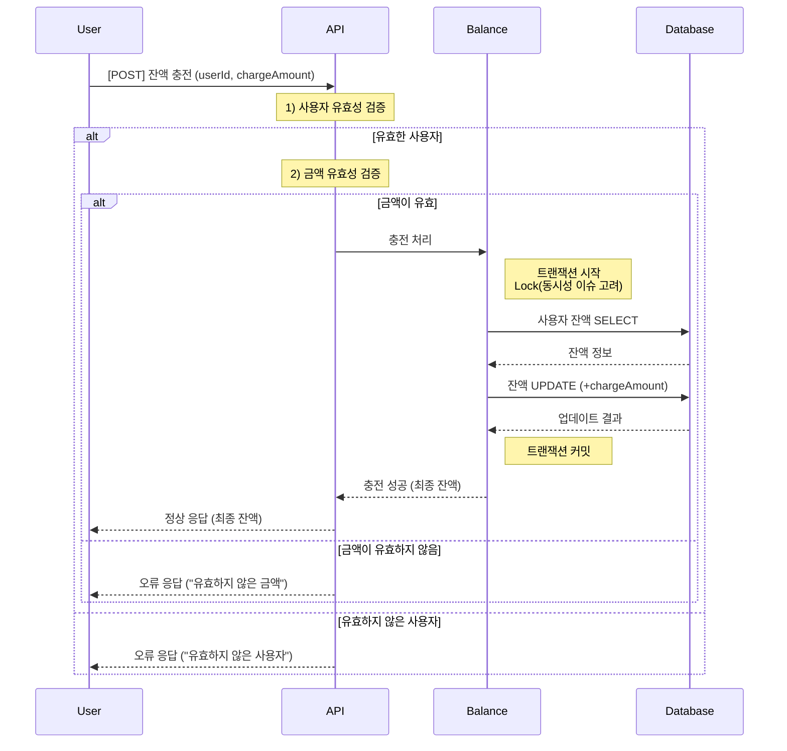
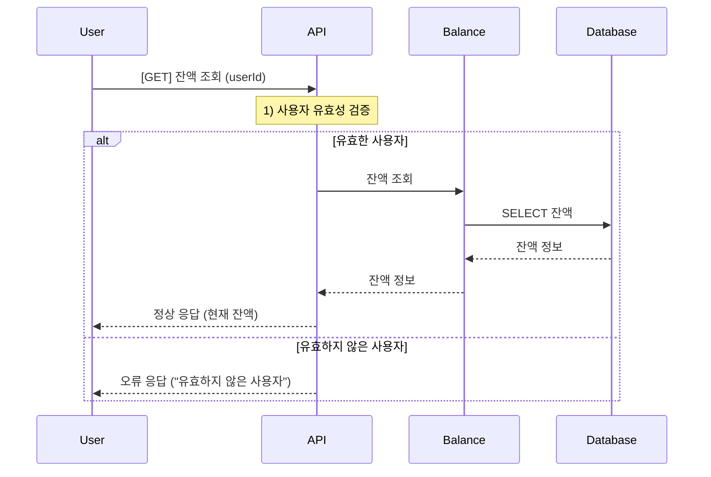
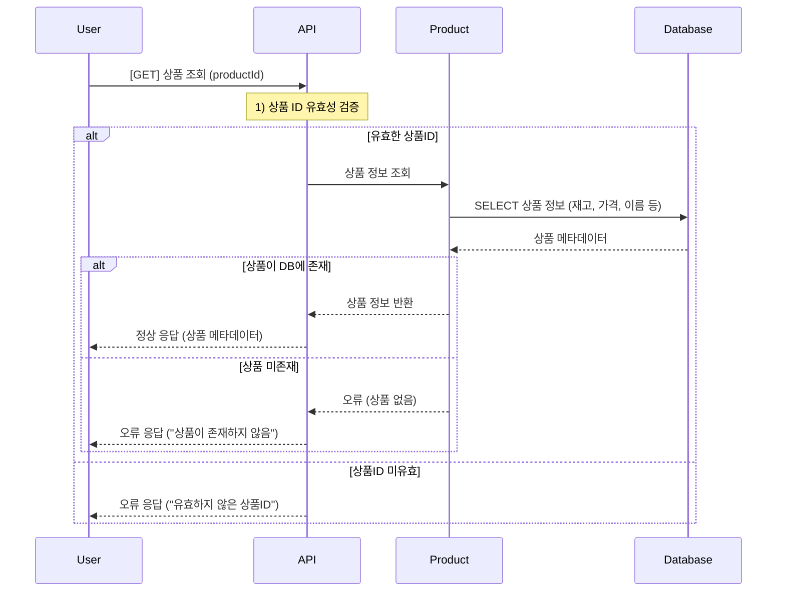
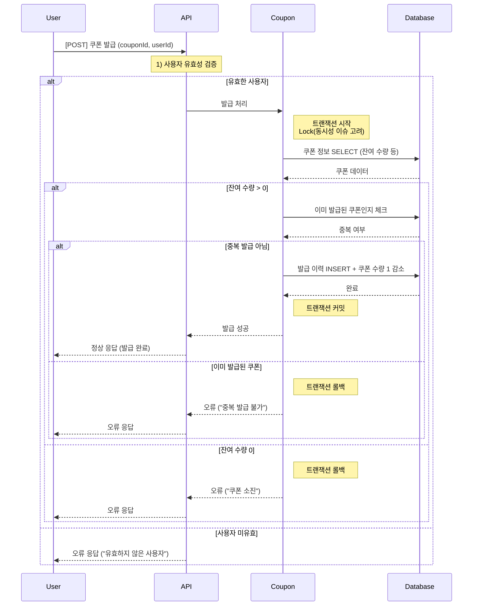
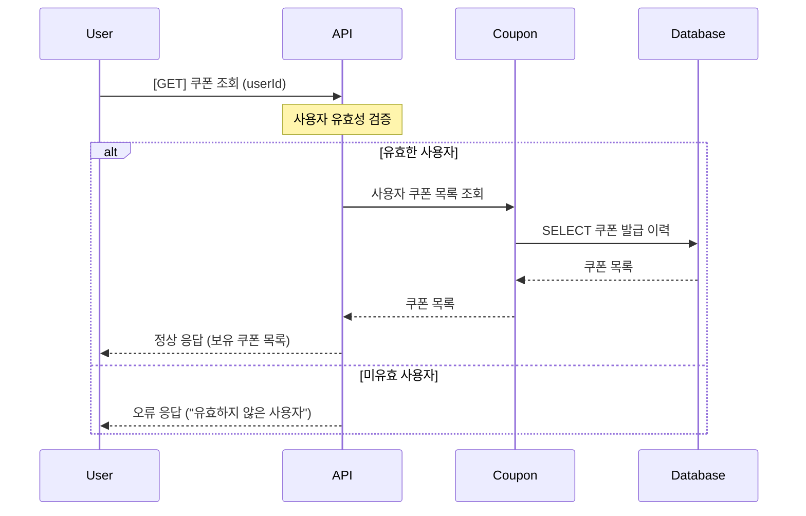
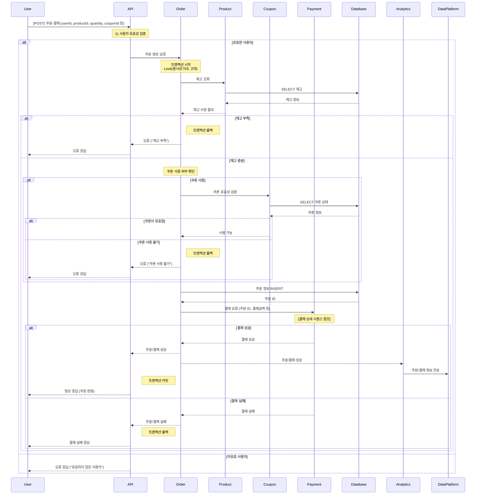
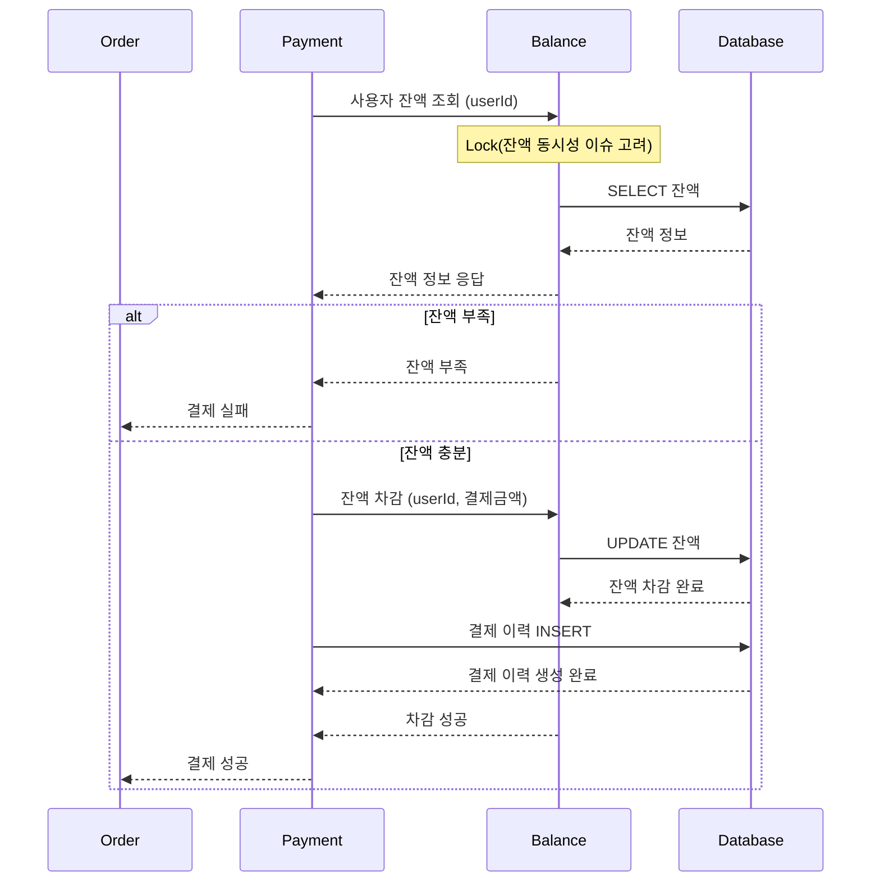
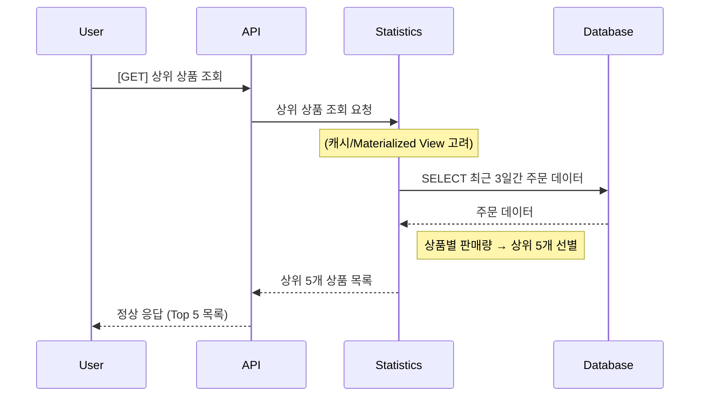

# e-커머스 서비스 - 시퀀스 다이어그램

## 잔액 충전

---

- **Balance**에서 잔액을 관리하며, DB 트랜잭션/Lock을 통해 동시성 이슈를 방지합니다.
- 충전 후 최종 잔액을 반환합니다.
- 조회는 단순 Select로 사용자의 잔액을 전달합니다.

 

## 잔액 조회

---

- **Balance**에서 사용자의 잔액을 조회합니다.
- 사용자 ID로 DB에서 잔액 정보를 조회하여 반환합니다.
- 사용자가 유효하지 않을 경우 오류 응답을 반환합니다.

## 상품 조회

---

- **Product**가 상품 목록을 DB에서 조회하여 반환합니다.
- 사용자에게 상품명, 가격, 재고 등의 정보를 보여줍니다.
- 재고는 주문 시점에 다시 한 번 확인이 필요합니다.

 

## 쿠폰 발급

---

- **Coupon**에서 쿠폰 발급을 관리하며, 중복 발급 여부와 잔여 수량을 확인합니다.
- 발급 성공 시 쿠폰 발급 이력을 저장하고, 잔여 수량을 감소시킵니다.

## 쿠폰 조회

- 사용자 ID로 쿠폰 테이블(또는 발급 이력 테이블)에서 보유 중인 쿠폰 목록을 조회합니다.
- 유효 기간이나 사용 여부 등은 추가 로직으로 확장 가능합니다.

 

## 주문-결제

---

- **Order**가 트랜잭션을 관리하며 쿠폰 유효성 → 재고 확인 → 주문 생성 → 결제 로직을 순차적으로 진행합니다.
- 결제 로직은 **결제 상세** 시퀀스 참조로 분리하여 설명합니다.
- 최종적으로 재고 차감, 쿠폰 사용 처리까지 한 번에 처리한 뒤, **Analytics**으로 데이터 플랫폼으로 주문 정보를 전송할 수 있습니다.

 

## 결제 상세

- **Payment**에서 결제 로직을 처리합니다.
- 결제 전 **Balance**에서 잔액을 조회하여 잔액이 충분한지 확인합니다.
- 잔액이 부족하면 결제 실패, 충분하면 잔액을 차감합고 결제를 성공시킵니다.
- 결과를 **Order**로 반환합니다.

## 상위 상품 조회

---

- **Statistics**(또는 다른 이름)가 최근 3일간 주문 테이블을 조회하여 상품별 판매량을 계산합니다.
- 상위 5개 상품을 선정해 사용자에게 반환합니다.
- 대량 트래픽이 예상될 시 Materialized View 나 비정규화된 특수 테이블을 고려해야합니다. 우선, 단순 SELECT 후 계산으로 가정합니다.
