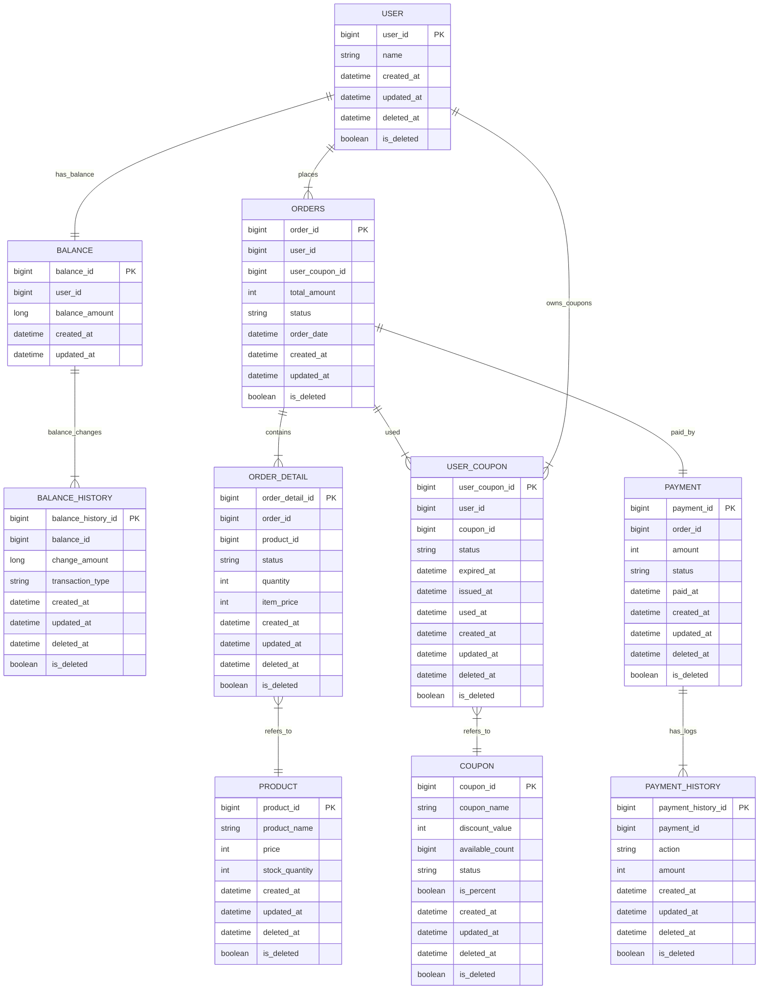

# e-커머스 서비스 - ERD

## 공통 필드
- **created_at**: 해당 Row의 생성 시간을 기록합니다.
- **updated_at**: 해당 Row의 마지막 업데이트 시간을 기록합니다.
- **is_deleted**: 소프트 딜리트 여부를 나타냅니다.
- **deleted_at**: 해당 Row의 소프트 딜리트 시점을 기록합니다.

---

## USER 테이블
**역할**: 회원 정보 관리
- 사용자의 기본 정보(이름 등)과 삭제 여부를 관리합니다.

**주요 필드**:
- **user_id**: 사용자를 고유하게 식별하는 기본 키.
- **name**: 사용자의 이름.
- **is_deleted**: 탈퇴 여부를 나타내는 플래그.

**요구사항 대응**:
- `user_id`를 기반으로 주문, 잔액 등의 관계를 설정합니다
- 탈퇴, 삭제 사용자는 비활성화 처리(`is_deleted`)를 통해 관리합니다.

---

## BALANCE 테이블
**역할**: 사용자 잔액 관리
- 사용자의 현재 잔액을 관리하며, `BALANCE_HISTORY`와 연계하여 잔액 변동 내역을 추적합니다.

**주요 필드**:
- **balance_id**: 잔액 데이터를 고유하게 식별하는 기본 키.
- **user_id**: 해당 잔액이 연결된 사용자 ID.
- **balance_amount**: 현재 사용 가능한 잔액.

**요구사항 대응**:
- `balance_amount` 필드를 통해 현재 잔액을 빠르게 조회할 수 있습니다. 잔액 동시성 이슈의 관리 중점 포인트입니다.
- 사용자 잔액 변동 내역은 `BALANCE_HISTORY` 테이블에서 별도로 관리됩니다.

---

## BALANCE_HISTORY 테이블
**역할**: 잔액 변동 이력 관리
- 잔액의 증가(충전), 감소(사용) 내역을 기록합니다.

**주요 필드**:
- **balance_history_id**: 잔액 이력을 고유하게 식별하는 기본 키.
- **balance_id**: 관련 잔액 정보와 연결.
- **change_amount**: 잔액 변동 금액.
- **transaction_type**: 변동 유형(DEPOSIT, WITHDRAW 등).

**요구사항 대응**:
- `transaction_type` 필드로 잔액 변동의 원인을 추적할 수 있습니다.
- 사용자별 잔액 히스토리를 조회하여 모든 거래 내역을 확인할 수 있습니다.

---

## PRODUCT 테이블
**역할**: 상품 정보 관리
- 상품의 기본 정보와 재고 상태를 관리합니다.

**주요 필드**:
- **product_id**: 상품을 고유하게 식별하는 기본 키.
- **product_name**: 상품 이름.
- **price**: 상품 가격.
- **stock_quantity**: 현재 재고 수량.

**요구사항 대응**:
- `stock_quantity`를 기반으로 재고를 실시간으로 관리할 수 있습니다. 재고 동시성 이슈 관리 중점 포인트입니다.
- 상품 상태(`is_deleted`)를 통해 단종된 상품을 비활성화 처리합니다.

---

## COUPON 테이블
**역할**: 쿠폰 정보 관리
- 할인 정보 및 사용 가능한 쿠폰의 수량을 관리합니다.

**주요 필드**:
- **coupon_id**: 쿠폰을 고유하게 식별하는 기본 키.
- **coupon_name**: 쿠폰 이름.
- **discount_value**: 할인 금액 또는 할인율.
- **is_percent**: 할인 값이 퍼센트인지 여부.
- **available_count**: 사용 가능한 남은 쿠폰 수량.
- **status**: 해당 쿠폰의 상태를 관리(ACTIVE, INACTIVE).

**요구사항 대응**:
- `available_count` 필드를 사용하여 쿠폰의 재고를 실시간으로 관리할 수 있습니다. 쿠폰 재고 동시성 이슈 관리 중점 포인트입니다.
- `is_percent`를 통해 고정 할인 또는 퍼센트 할인 여부를 구분합니다.

---

## USER_COUPON 테이블
**역할**: 사용자가 보유 중인 쿠폰 관리
- 사용자가 소유한 쿠폰과 사용 상태를 관리합니다.

**주요 필드**:
- **user_coupon_id**: 보유 쿠폰을 고유하게 식별하는 기본 키.
- **user_id**: 해당 쿠폰을 소유한 사용자.
- **coupon_id**: 쿠폰 정보와 연결.
- **status**: 쿠폰 상태 정보(USED, NOT_USED).

**요구사항 대응**:
- `user_id`와 `coupon_id`를 기반으로 특정 사용자의 쿠폰 보유 및 사용 여부를 확인할 수 있습니다.
- `expired_at` 을 통해 쿠폰의 발급시점으로부터 유효기간을 관리합니다.

---

## ORDERS 테이블
**역할**: 주문 정보 관리
- 주문의 총 금액, 상태, 날짜 등을 관리합니다.

**주요 필드**:
- **order_id**: 주문을 고유하게 식별하는 기본 키.
- **user_id**: 주문한 사용자와 연결.
- **total_amount**: 주문의 총 금액.
- **status**: 주문 상태(PENDING, COMPLETED, CANCELLED 등).

**요구사항 대응**:
- `status` 필드를 통해 주문의 진행 상태를 관리할 수 있습니다.
- `user_id`를 기반으로 특정 사용자의 주문 이력을 조회할 수 있습니다.

---

## ORDER_DETAIL 테이블
**역할**: 주문 상세 관리
- 주문에 포함된 각 상품의 정보를 관리합니다.

**주요 필드**:
- **order_detail_id**: 주문 상세를 고유하게 식별하는 기본 키.
- **order_id**: 주문 정보와 연결.
- **product_id**: 포함된 상품 정보와 연결.
- **quantity**: 해당 상품의 주문 수량.
- **item_price**: 해당 상품의 단가.

**요구사항 대응**:
- `product_id`를 기반으로 특정 상품이 포함된 주문 내역을 조회할 수 있습니다.

---

## PAYMENT 테이블
**역할**: 결제 정보 관리
- 주문별 결제 금액 및 상태를 관리합니다.

**주요 필드**:
- **payment_id**: 결제를 고유하게 식별하는 기본 키.
- **order_id**: 해당 결제가 연결된 주문.
- **amount**: 결제 금액.
- **status**: 결제 상태(PAID, REFUNDED 등).

**요구사항 대응**:
- `status` 필드를 통해 결제 완료, 취소, 환불 상태를 관리할 수 있습니다.

---

## PAYMENT_HISTORY 테이블
**역할**: 결제 상태 변경 이력 관리
- 결제 상태가 변경될 때마다 이력을 기록합니다.

**주요 필드**:
- **payment_history_id**: 결제 이력을 고유하게 식별하는 기본 키.
- **payment_id**: 관련 결제 정보와 연결.
- **action**: 상태 변경 유형(REFUND, CANCEL 등).
- **amount**: 상태 변경 금액.

**요구사항 대응**:
- `action` 필드를 기반으로 결제 변경 내역을 추적할 수 있습니다.

---

## 설계 이유
- **테이블 분리**: 잔액, 쿠폰, 주문, 결제를 각각 독립적인 테이블로 분리하여 관리.
- **소프트 딜리트**: `is_deleted`를 통해 데이터를 물리적으로 삭제하지 않고 비활성화 상태로 유지.
- **유연한 관계**: 논리적인 외래 키를 통해 데이터 연결성을 유지하며, 필요에 따라 확장 가능.

