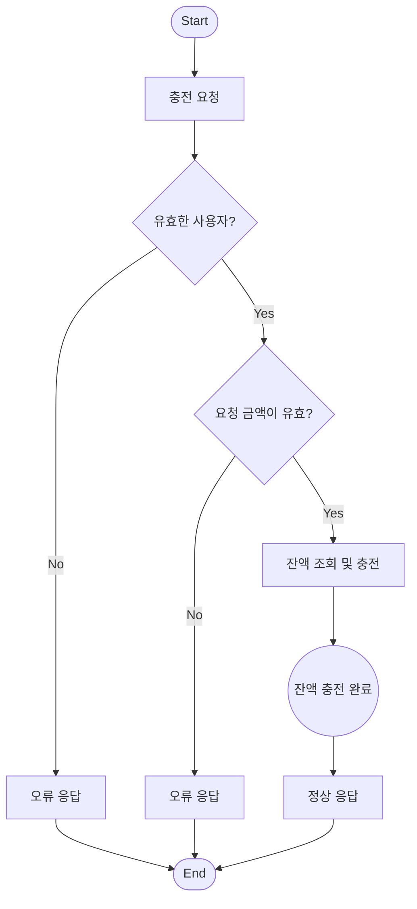
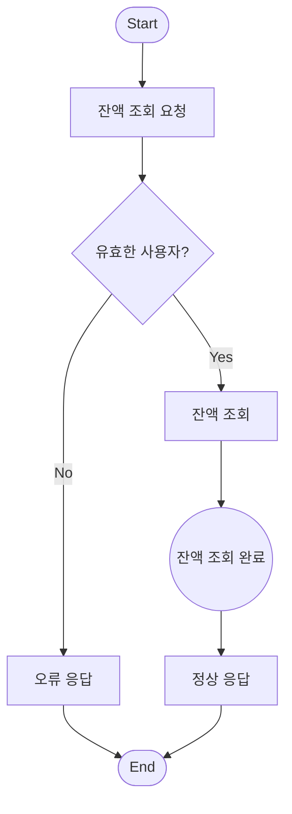
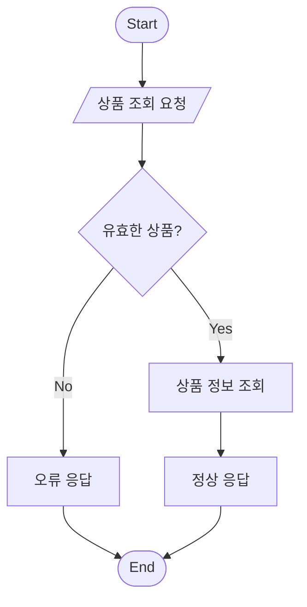
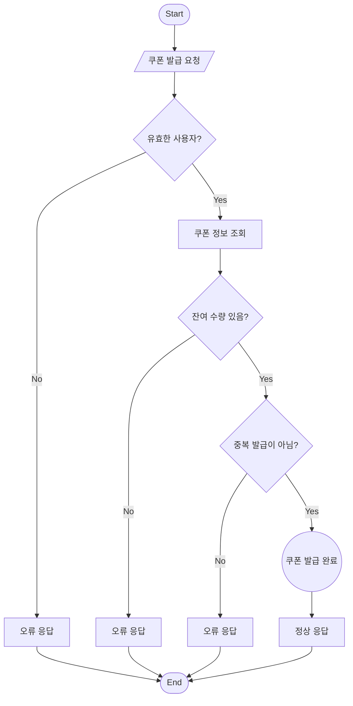
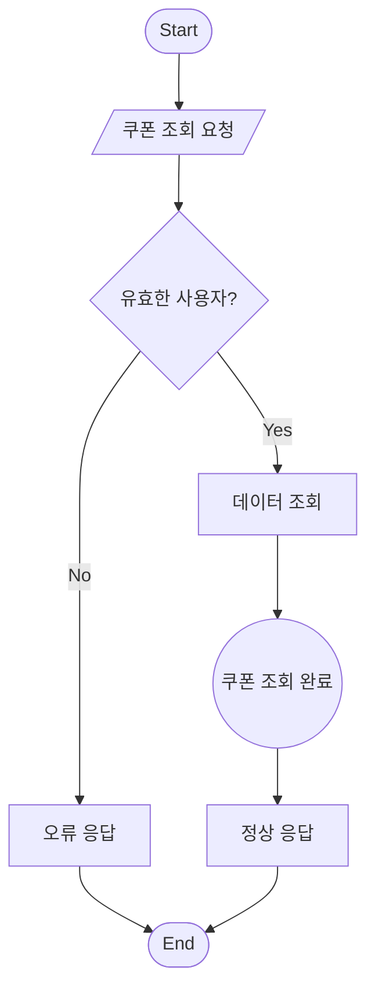
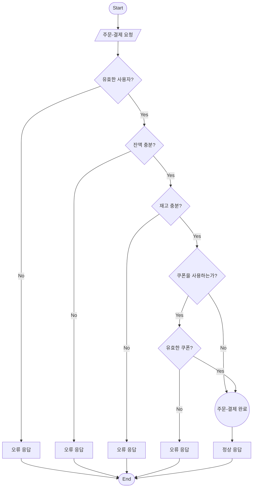
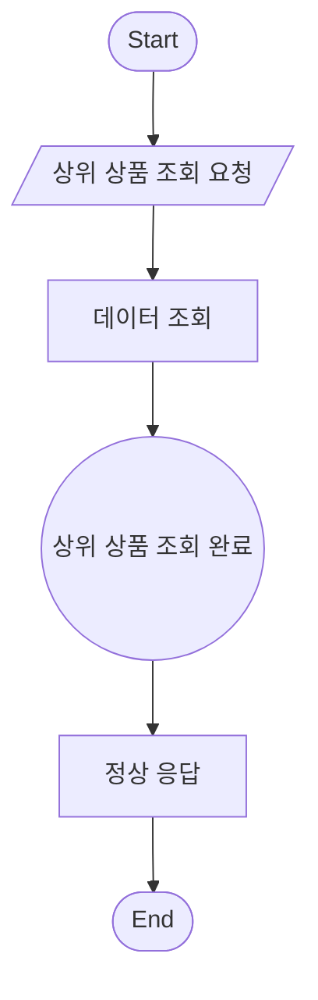

# e-커머스 서비스 - 플로우 차트

---

## 잔액 충전

```mermaid
flowchart TB
    A(["Start"]) --> B["충전 요청"]
    B --> C{"유효한 사용자?"}
    C -- No --> D["오류 응답"]
    C -- Yes --> E{"요청 금액이 유효?"}
    E -- No --> F["오류 응답"]
    E -- Yes --> G["잔액 조회 및 충전"]
    G --> H(("잔액 충전 완료"))
    H --> I["정상 응답"]
    F --> J
    D --> J
    I --> J(["End"])

```

## 잔액 조회

```mermaid
flowchart TB
    A(["Start"]) --> B["잔액 조회 요청"]
    B --> C{"유효한 사용자?"}
    C -- No --> D["오류 응답"]
    C -- Yes --> E["잔액 조회"]
    E --> F(("잔액 조회 완료"))
    F --> G["정상 응답"]
    D --> H
    G --> H(["End"])
```

## 상품 조회

```mermaid
flowchart TB

    A(["Start"]) --> B[/"상품 조회 요청"/]
    B --> C{"유효한 상품?"}
    C -- No --> D["오류 응답"]
    C -- Yes --> E["상품 정보 조회"]
    E --> I["정상 응답"]
    D --> J
    I --> J(["End"])

```

## 쿠폰 발급

```mermaid
flowchart TB
    A(["Start"]) --> B[/"쿠폰 발급 요청"/]
    B --> C{"유효한 사용자?"}
    C -- No --> D["오류 응답"]
    C -- Yes --> E["쿠폰 정보 조회"]
    E --> F{"잔여 수량 있음?"}
    F -- No --> G["오류 응답"]
    F -- Yes --> H{"중복 발급이 아님?"}
    H -- No --> I["오류 응답"]
    H -- Yes --> J(("쿠폰 발급 완료"))
    J --> K["정상 응답"]
    D --> L
    G --> L
    I --> L
    K --> L(["End"])
```

## 쿠폰 조회

```mermaid
flowchart TB
    A(["Start"]) --> B[/"쿠폰 조회 요청"/]
    B --> C{"유효한 사용자?"}
    C -- No --> D["오류 응답"]
    C -- Yes --> E["데이터 조회"]
    E --> F(("쿠폰 조회 완료"))
    F --> G["정상 응답"]
    D --> H
    G --> H(["End"])

```

## 주문-결제

```mermaid
flowchart TB
    A(["Start"]) --> B[/"주문-결제 요청"/]
    B --> C{"유효한 사용자?"}
    C -- No --> D["오류 응답"]
    C -- Yes --> E{"잔액 충분?"}
    E -- No --> F["오류 응답"]
    E -- Yes --> G{"재고 충분?"}
    G -- No --> H["오류 응답"]
    G -- Yes --> I{"쿠폰을 사용하는가?"}
    I -- No --> J(("주문-결제 완료"))
    I -- Yes --> K{"유효한 쿠폰?"}
    K -- No --> L["오류 응답"]
    K -- Yes --> J
    D --> N
    F --> N
    H --> N
    L --> N
    J --> M["정상 응답"]
    M --> N(["End"])
```

## 상위 상품 조회

```mermaid
flowchart TB
    A(["Start"]) --> B[/"상위 상품 조회 요청"/]
    B --> C["데이터 조회"]
    C --> E(("상위 상품 조회 완료"))
    E --> F["정상 응답"]
    F --> G(["End"])
```