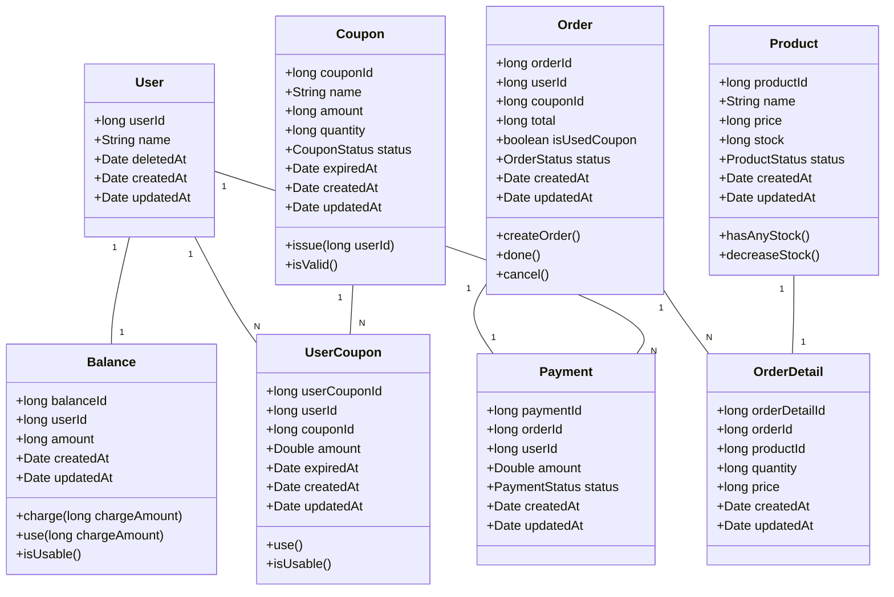

# e-커머스 서비스 - 클래스 다이어그램

---

- 시퀀스 다이어그램, 플로우차트로부터 추출된 클래스 다이어그램입니다.
- **User**: 사용자 정보를 관리합니다.
- **Balance**: 사용자의 잔액을 관리하며, 충전 및 사용 기능을 제공합니다.
- **Product**: 상품 정보를 관리하며, 재고 수량을 확인하고 감소시킵니다.
- **Coupon**: 쿠폰 정보를 관리하며, 발급 및 유효성 검증 기능을 제공합니다.
- **UserCoupon**: 사용자별 쿠폰 발급 이력을 관리하며, 사용 및 유효성 검증 기능을 제공합니다.
- **Order**: 주문 정보를 관리하며, 주문 생성 및 상태 변경 기능을 제공합니다.
- **OrderDetail**: 주문 상세 정보를 관리합니다.
- **Payment**: 결제 정보를 관리합니다.
- 현재 요구사항에서는 결제에 관련한 요구사항이 없고, 결제 자체는 Order 로 인한 Balance 의 차감으로 구현됩니다. 따라서 Payment 자체가 History 가 됩니다.
- 통계(Statistics) 의 경우에는 따로 클래스를 통해서 구현하는 것이 아니라 Product 를 활용하여 서비스의 일부로 구현됩니다.

