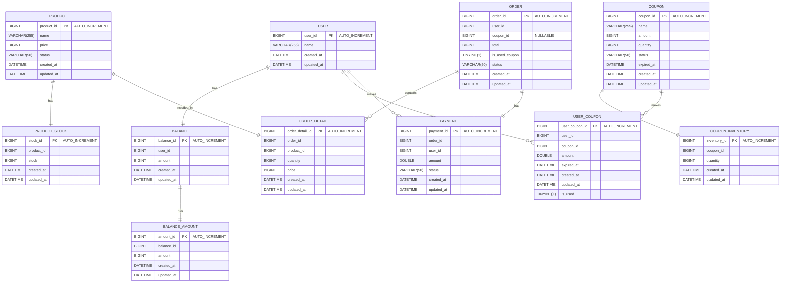

# e-커머스 서비스 - ERD

## 공통 필드

- **created_at**: 해당 Row의 생성 시간을 기록합니다.
- **updated_at**: 해당 Row의 마지막 업데이트 시간을 기록합니다.

---

## USER 테이블

**역할**: 회원 정보 관리

- 사용자의 기본 정보(이름 등)과 삭제 여부를 관리합니다.

**주요 필드**:

- **user_id**: 사용자를 고유하게 식별하는 기본 키.
- **name**: 사용자의 이름.

**요구사항 대응**:

- `user_id`를 기반으로 주문, 잔액 등의 관계를 설정합니다

---

## BALANCE 테이블

**역할**: 사용자 잔액 관리

- 사용자의 현재 잔액을 관리하며, `BALANCE_AMOUNT`와 연계하여 잔액의 변동을 관리합니다.

**주요 필드**:

- **balance_id**: 잔액 데이터를 고유하게 식별하는 기본 키.
- **user_id**: 해당 잔액이 연결된 사용자 ID.
- **amount**: 현재 사용 가능한 잔액. (조회용)

**요구사항 대응**:

- `amount` 필드를 통해 현재 잔액을 빠르게 조회할 수 있습니다.
- 사용자의 잔액의 변동은 `BALANCE_AMOUNT` 테이블을 통해 관리합니다.

---

## BALANCE_AMOUNT 테이블

**역할**: 사용자 잔액 관리

- 잔액의 증가(충전), 감소(사용) 등의 변동을 관리합니다.

**주요 필드**:

- **amount_id**: BALANCE_AMOUNT를 고유하게 식별하는 기본 키.
- **balance_id**: 잔액의 키값으로 BALANCE 를 고유하게 인식하는 키
- **amount**: 사용자의 현재 잔액. (수정용)

**요구사항 대응**:

- 동시성 제어의 대응을 위해 존재하는 테이블로 수정 시에는 해당 테이블을 사용합니다.

---

## PRODUCT 테이블

**역할**: 상품 정보 관리

- 상품의 기본 정보와 재고 상태를 관리합니다.

**주요 필드**:

- **product_id**: 상품을 고유하게 식별하는 기본 키.
- **product_name**: 상품 이름.
- **price**: 상품 가격.
- **stock**: 현재 재고 수량.
- **status**: 현재 상품의 상태

**요구사항 대응**:

- 상품의 정보를 저장하는 일종의 메타 테이블로 단순 조회를 위해 사용됩니다.
- 해당 테이블의 stock 은 단순 조회용으로 사용됩니다.
- status 는 현재 상품의 상태로 해당 재고의 품절등의 상태를 관리합니다.

---

## COUPON 테이블

**역할**: 쿠폰 정보 관리

- 할인 정보 및 사용 가능한 쿠폰의 수량을 관리합니다.

**주요 필드**:

- **coupon_id**: 쿠폰을 고유하게 식별하는 기본 키.
- **name**: 쿠폰 이름.
- **amount**: 할인 금액 또는 할인율.
- **quantity**: 사용 가능한 남은 쿠폰 수량.
- **status**: 해당 쿠폰의 상태를 관리

**요구사항 대응**:

- `quantity` 필드를 사용하여 현재 쿠폰의 남은 수량을 조회할 수 있습니다.
- `status` 필드를 통해 쿠폰의 사용 가능 여부를 관리합니다.

---

## USER_COUPON 테이블

**역할**: 사용자가 보유 중인 쿠폰 관리

- 사용자가 소유한 쿠폰과 사용 상태를 관리합니다.

**주요 필드**:

- **user_coupon_id**: 보유 쿠폰을 고유하게 식별하는 기본 키.
- **user_id**: 해당 쿠폰을 소유한 사용자.
- **coupon_id**: 쿠폰 정보와 연결.
- **status**: 쿠폰 상태 정보(USED, NOT_USED).

**요구사항 대응**:

- `user_id`와 `coupon_id`를 기반으로 특정 사용자의 쿠폰 보유 및 사용 여부를 확인할 수 있습니다.
- `expired_at` 을 통해 쿠폰의 발급시점으로부터 유효기간을 관리합니다.

---

## ORDER 테이블

**역할**: 주문 정보 관리

- 주문의 총 금액, 상태, 날짜 등을 관리합니다.

**주요 필드**:

- **order_id**: 주문을 고유하게 식별하는 기본 키.
- **user_id**: 주문한 사용자와 연결 키.
- **coupon_id**: 사용된 쿠폰 정보와 연결 키.
- **is_used_coupon**: 해당 주문이 쿠폰을 사용했는지 여부
- **status**: 주문 상태를 관리

**요구사항 대응**:

- `status` 필드를 통해 주문의 진행 상태를 관리할 수 있습니다.
- `user_id`를 기반으로 특정 사용자의 주문 이력을 조회할 수 있습니다.
- `is_used_coupon`을 통해 쿠폰 사용 여부를 확인할 수 있습니다.
- `ORDER_DETAIL` 테이블과 연계하여 해당 주문의 상세 내용을 관리합니다.

---

## ORDER_DETAIL 테이블

**역할**: 주문 상세 관리

- 주문에 포함된 각 상품의 정보를 관리합니다.

**주요 필드**:

- **order_detail_id**: 주문 상세를 고유하게 식별하는 기본 키.
- **order_id**: 주문 정보와 연결.
- **product_id**: 포함된 상품 정보와 연결.
- **quantity**: 해당 상품의 주문 수량.
- **price**: 해당 상품의 단가.

**요구사항 대응**:

- `product_id`를 기반으로 특정 상품이 포함된 주문 내역을 조회할 수 있습니다.

---

## PAYMENT 테이블

**역할**: 결제 정보 관리

- 주문별 결제 금액 및 상태를 저장합니다.

**주요 필드**:

- **payment_id**: 결제를 고유하게 식별하는 기본 키.
- **order_id**: 해당 결제가 연결된 주문.
- **amount**: 결제 금액.
- **status**: 결제 상태

**요구사항 대응**:

- `status` 필드를 통해 결제 완료, 취소, 환불 상태를 관리할 수 있습니다.
- 현재 요구사항에서 `PAYMENT`의 경우 단순 기록 저장용으로만 사용됩니다.
- 결제는 `BALANCE` 의 차감으로서만 구현되고 추가적인 결제 수단이 없어 결제의 정보를 저장하는것에 초점을 둡니다.
