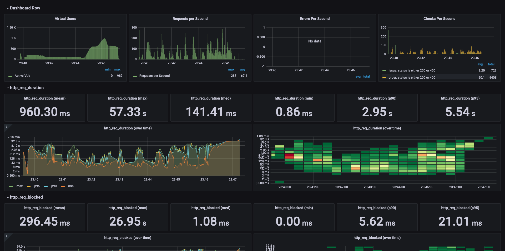
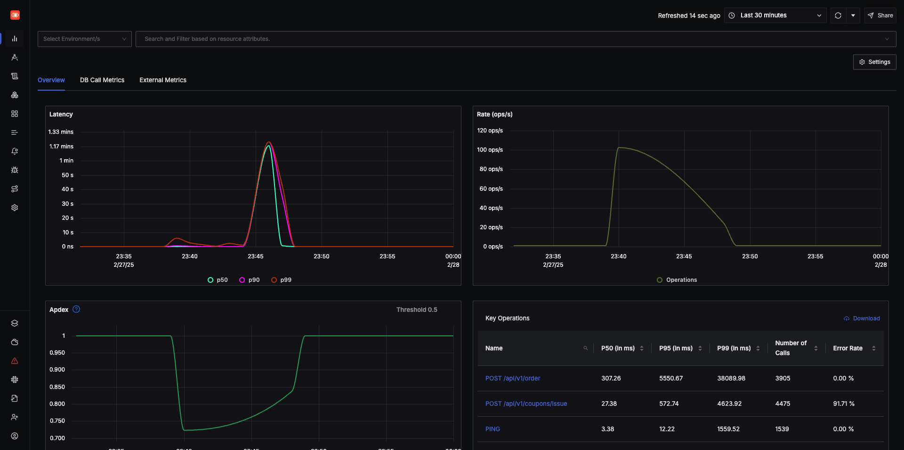
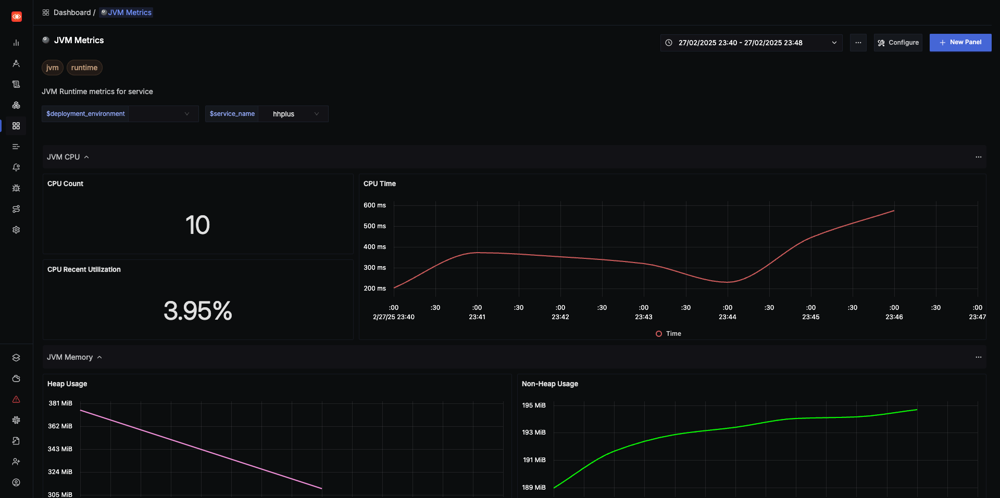

# 부하 테스트 계획 및 수행 보고서

## 1. 개요

### 1.1 테스트 대상 선정

- **쿠폰 발급 API:**
    - **선정 이유:** 선착순 쿠폰 발급 이벤트의 특성상 단기간에 매우 높은 트래픽이 몰릴 수 있습니다. 이로 인해 동시성 처리 능력과 장애 발생 시 시스템의 복원력을 점검할 필요가 있습니다.
- **주문 API:**
    - **선정 이유:** E커머스 도메인의 핵심 업무인 주문 처리는 서비스의 안정성과 사용자 경험에 직결됩니다. 따라서 정상 운영 시의 평균 부하뿐만 아니라, 갑작스런 트래픽 증가 상황에 대한 대응력을 평가해야
      합니다.

### 1.2 테스트 목적

- **성능 평가:** API의 응답시간, 처리량, 자원 사용률을 측정하여 성능 병목을 파악합니다.
- **동시성 처리 검증:** 다수의 가상 사용자가 동시에 요청을 보낼 때 시스템이 안정적으로 동작하는지 확인합니다.
- **장애 대응 확인:** 부하가 급증하거나 시스템 한계를 초과하는 상황에서 장애 발생 및 복구 시나리오를 검증합니다.
- **향후 개선점 도출:** 테스트 결과를 바탕으로 성능 최적화 및 인프라 확장 방안 수립에 필요한 데이터를 확보합니다.

---

## 2. 테스트 시나리오 계획

### 2.1 시나리오 유형 및 목표

- **Peak Test (피크 테스트):**
    - **목적:** 예상되는 최대 트래픽 상황을 단기간에 시뮬레이션하여, API의 최대 처리 능력 및 급격한 부하 상황에서의 안정성을 평가합니다.
    - **설정:**
        - 쿠폰 발급: 300명의 VU, 300번의 iteration, 30초 내 완료 (시작 전 10초 준비)
        - 주문: 300명의 VU, 300번의 iteration, 30초 내 완료 (쿠폰 발급 후 10초 준비)

- **Load Test (부하 테스트):**
    - **목적:** 정상 운영 시 예상되는 평균 트래픽 상황에서의 응답시간과 시스템 자원 사용률, 안정성을 확인합니다.
    - **설정:**
        - 쿠폰 발급: 100명의 VU, 1분 동안 지속 (이전 시나리오 종료 후 10초 준비)
        - 주문: 100명의 VU, 1분 동안 지속 (쿠폰 발급 후 10초 준비)

- **Endurance Test (내구도 테스트):**
    - **목적:** 장시간 동안 일정 부하를 유지하며 메모리 누수, 성능 저하 등 시간이 지남에 따라 발생할 수 있는 문제를 탐지합니다.
    - **설정:**
        - 쿠폰 발급: 50명의 VU, 10분 동안 지속 (이전 시나리오 종료 후 10초 준비)
        - 주문: 50명의 VU, 10분 동안 지속 (쿠폰 발급 후 10초 준비)

- **Stress Test (스트레스 테스트):**
    - **목적:** 시스템이 감당할 수 있는 최대 부하 한계를 넘어서는 부하를 가해, 장애 발생 및 복구 과정을 확인하고, 한계치 도달 시 대응 방안을 마련합니다.
    - **설정:**
        - 쿠폰 발급: VU를 10명에서 시작해 점진적으로 300명, 이후 500명까지 증가 후 부하를 낮추는 단계적 증가/감소 (이전 시나리오 종료 후 10초 준비)
        - 주문: 위와 동일한 ramping 설정 (쿠폰 발급 후 10초 준비)

### 2.2 테스트 준비 및 실행 전략

- **준비시간 적용:**  
  각 시나리오 실행 전 최소 10초의 준비 시간을 두어, 이전 테스트의 잔여 부하나 리소스 영향을 최소화하고 독립적인 결과를 확보합니다.
- **동시 실행 조정:**  
  시나리오 간의 시작 시점을 조정하여, 테스트 간 간섭을 방지하고 각 유형의 부하 조건을 명확히 분리합니다.

---

## 3. 테스트 스크립트 설명

### 3.1 스크립트 개요

- **사용 도구:** k6
- **주요 기능:**
    - HTTP POST 요청을 통해 쿠폰 발급 및 주문 API에 트래픽을 발생시킴
    - 응답 상태 코드를 확인(200, 400)하고, 각 상태에 따라 커스텀 메트릭(Counter)을 기록함
    - `check()` 함수로 응답 검증 후, 예외 상황(200, 400 외)의 경우 콘솔 로그를 남김

### 3.2 스크립트 주요 구성 요소

- **시나리오 구성:**
    - Peak, Load, Endurance, Stress 각 테스트 유형별로 executor와 설정(VU 수, duration, startTime 등)을 세분화하여 구성
- **커스텀 메트릭:**
    - 응답 코드에 따른 성공/실패 건수를 기록해, 테스트 종료 후 결과 분석 시 장애 발생 패턴을 파악할 수 있도록 함

---

## 4. 테스트 수행 및 결과 분석

### 4.1 수행 방법

- 작성된 스크립트를 k6 명령어를 통해 실행하였습니다.
- 각 시나리오별로 로그와 메트릭 데이터를 수집하여, InfluxDB 를 사용해 Grafana 로 시각화 하였습니다.
- APM 은 간단한 테스트 환경을 가정하여 복잡한 설정이 따로 필요하지 않고, OpenTelemetry 를 이용하여 간단하게 탑재할 수 있는 Signoz 를 사용하였습니다.

### 4.2 결과 분석

- **Peak Test:**
    - **쿠폰 발급:** 300 VU의 동시 요청 대부분 성공하였으나, 일부 Reset 현상 발생함(Connection Reset)
    - **주문:** 유사한 분포로, 급증한 부하 상황에서도 대부분 정상 처리되었으나, 특정 순간에 Reset 현상 발생(Connection Reset)
- **Load Test:**
    - 평균 부하 하에서는 응답시간이 안정적으로 유지되었으며, 자원 사용률도 정상 범위 내에서 운영됨
- **Endurance Test:**
    - 장시간 부하 테스트 시, Non-Heap Usage 는 지속적으로 상승하고 Heap Usage 는 지속적으로 감소하는 모습을 보임
    - 이는 GC 등으로 인해 단기 객체들이 줄어들고 로드되는 여러가지 정보들이 상승하는것으로 보임
- **Stress Test:**
    - 예상 최대 부하 초과 시, 장애 발생과정이 관찰되었음 지속적으로 에러 발생이 많아져 이러한 부하 상황에서는 특별한 확인이 필요함

- **테스트 결과**
  

- **APM 측정 결과**

---

## 5. 가상 장애 대응 문서

아래는 Stress Test 중 "connection reset by peer" 에러가 발생한 상황을 가정하여 작성한 가상의 장애 대응 문서 예시입니다.

---

# 장애 대응 문서

## 1. 요약

Stress Test 수행 중, 대량의 동시 연결 요청으로 인해 일부 서버 연결이 "connection reset by peer" 에러로 종료되는 장애가 발생하였습니다. 이로 인해 테스트 환경 내 일부 API(쿠폰
발급, 주문)의 응답에 지연과 연결 실패가 확인되었습니다. 즉각적인 서버 재시작과 네트워크 설정 조정을 통해 장애를 복구하였으며, 추가적인 재발 방지 대책을 마련 중입니다.

---

## 2. 장애 탐지 시간 / 장애 종료 시간

- **장애 탐지 시간:** 23:45:12  
  (모니터링 시스템에서 Stress Test 진행 중 에러 증가를 감지하여 알람 발생)
- **장애 종료 시간:** 23:47:12  
  (서버 재시작 및 네트워크 설정 조정 후 정상 상태 복구)

---

## 3. 영향받은 서비스/기능

- **서비스:**
    - 쿠폰 발급 API
    - 주문 API
- **기능:**
    - 네트워크 연결 관리 및 동시 요청 처리
    - 응답 처리 및 사용자 요청의 정상 서비스 제공

---

## 4. 영향 대상

- **사용자:**
    - 테스트 환경 내 가상 사용자(Stress Test 시나리오에 참여한 사용자)
- **시스템:**
    - API 서버의 네트워크 연결 관리 부분
    - 서버 리소스(메모리, 소켓 연결 등) 및 네트워크 대기열

---

## 5. 장애 원인

- **주요 원인:**
    - Stress Test 중, 예상보다 높은 동시 연결 요청이 발생하여 서버의 소켓 연결 대기열 및 최대 연결 수를 초과함.
    - 결과적으로, 서버가 일부 연결에 대해 "connection reset by peer" 에러를 발생시킴.
    - 초기 급증한 객체 생성 및 GC 동작 이후, 네트워크 관련 설정(예: 소켓 백로그, 연결 타임아웃) 미흡으로 인한 부하 처리 한계가 원인으로 분석됨.

---

## 6. 타임라인

- **00:00:00:** Stress Test 시작, 대량의 동시 연결 요청 발생
- **00:00:30:** 모니터링 시스템에서 "connection reset by peer" 에러 급증 감지 및 알람 발생
- **00:01:00:** 담당자에게 장애 상황 전파
- **00:02:11:** 서버 재시작 및 네트워크 설정(소켓 백로그, 연결 타임아웃 등) 조정 실시
- **00:02:45:** 서버 재시작 후 정상 연결 복구 및 에러 감소 확인
- **00:03:00:** 모니터링 시스템에서 장애 종료 및 정상 상태 보고

---

## 7. 해결 과정

1. **초기 대응:**
    - 모니터링 시스템을 통해 에러 발생을 인지하고, "connection reset by peer" 에러 증가 알람 수신
    - 즉시 담당자에게 장애 상황 전파 및 초기 원인 파악 시작

2. **원인 진단:**
    - 서버 로그 분석을 통해 Stress Test 시점에 동시 연결 요청 과부하 확인
    - 네트워크 설정 및 서버 리소스(소켓 대기열, 최대 연결 수 등) 한계 확인

3. **조치 실행:**
    - 서버 재시작을 통해 일시적인 자원 회수 및 연결 초기화 진행
    - 네트워크 설정(소켓 백로그, 연결 타임아웃) 조정으로 대량 연결 요청 처리 능력 강화
    - 필요 시 JVM 및 서버 관련 리소스 할당 최적화를 통한 추가 조치 검토

4. **모니터링 및 확인:**
    - 서버 재시작 후 정상적인 응답 및 연결 복구 확인
    - 모니터링 시스템에서 에러 지표 감소 및 정상 상태 복원 검증

---

## 8. 재발 방지 대책

1. **네트워크 설정 개선:**
    - 소켓 백로그, 연결 타임아웃 등 네트워크 관련 파라미터 재조정 및 최적화
    - 최대 연결 수 및 대기열 크기 확장을 통해 동시 연결 요청 처리 능력 강화

2. **리소스 모니터링 강화:**
    - JVM Heap, Non-Heap, GC 활동, 네트워크 연결 상태 등 주요 지표를 지속 모니터링
    - 임계치 도달 시 자동 알람 및 대응 프로세스 마련

3. **정기적인 부하 테스트 수행:**
    - Stress Test와 Load Test를 주기적으로 실행하여 시스템 한계와 병목 현상을 사전 파악
    - 테스트 결과에 따라 인프라 확장 및 최적화 방안 도입

4. **자동 복구 시스템 도입:**
    - 장애 발생 시 자동 재시작 및 스케일 아웃을 위한 자동화된 대응 시스템 도입
    - 장애 복구 시간을 최소화하기 위한 자동화 스크립트 개발
