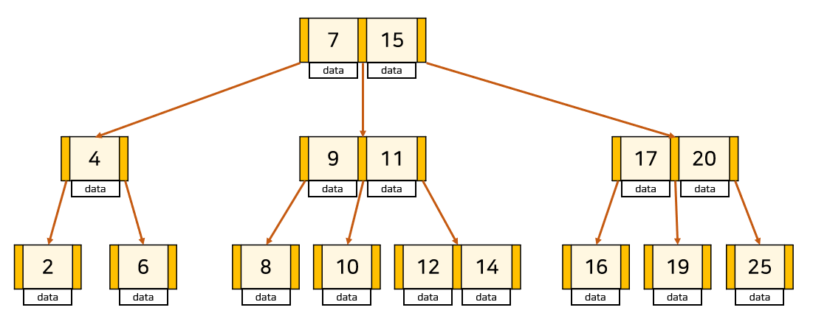
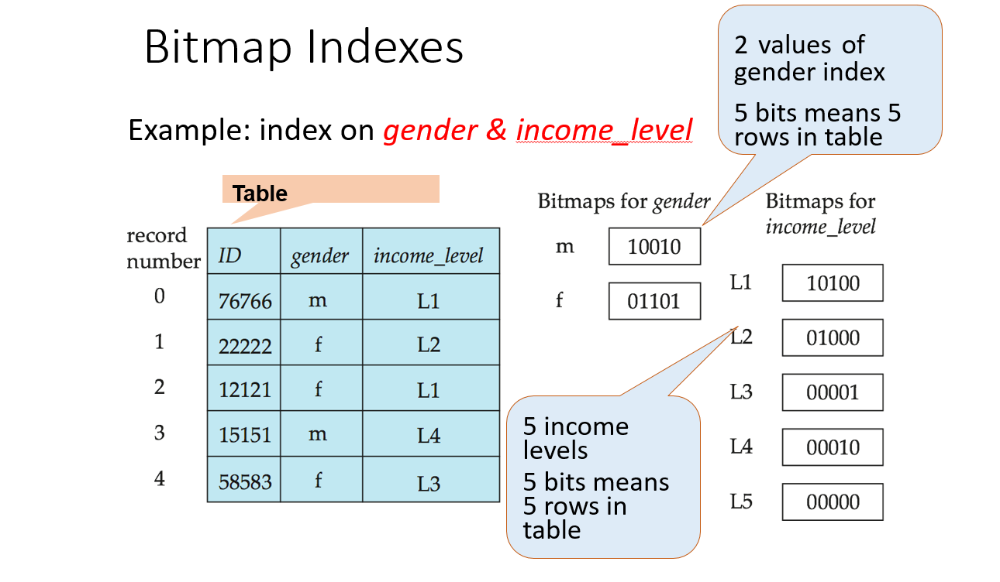
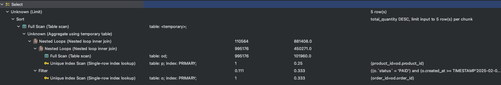
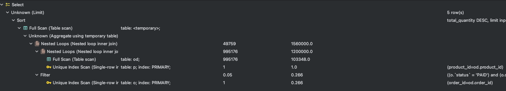

# 데이터베이스 인덱스 적용 보고서

## 개요

데이터베이스 성능 최적화의 핵심 도구 중 하나인 인덱스의 개념과 구현 방법, 그리고 e-커머스 환경에서의 적용 사례를 다룹니다.
대용량 데이터를 신속하게 처리해야 하는 e-커머스 시스템에서 인덱스는 조회 성능을 극대화하는 데 필수적인 요소입니다.
이 보고서에서는 인덱스의 기본 원리와 자료구조, 인덱스 사용의 장단점 및 적절한 활용 사례를 분석하고,
실제 e-커머스 시나리오에서의 조회 쿼리와 초기 성능 문제를 진단한 후 적용한 인덱스 전략을 소개하겠습니다.

## 인덱스란 무엇인가?

데이터베이스 인덱스는 도서관의 색인과 유사하게, 테이블 내의 데이터를 효율적으로 검색하기 위한 데이터 구조입니다.
인덱스를 사용하면 전체 테이블을 순차적으로 스캔하지 않고도 원하는 데이터를 빠르게 찾을 수 있으므로, 특히 대용량 데이터 처리 환경에서 응답 속도 향상에 큰 역할을 합니다.

### 인덱스 타입

**클러스터링 인덱스**

클러스터링 인덱스는 테이블의 실제 데이터 저장 순서가 인덱스 키 값의 정렬 순서와 일치하도록 관리됩니다. 즉, 인덱스 자체가 데이터의 물리적 순서를 결정하며, 범위 검색 및 정렬된 데이터 조회에 매우 유리합니다.

테이블 당 단 하나의 클러스터링 인덱스만 생성할 수 있습니다.
데이터의 물리적 저장 순서를 재구성하므로, 데이터 삽입, 수정, 삭제 시 추가적인 오버헤드가 발생할 수 있습니다.
대용량 데이터의 범위 조회 성능을 극대화하는 데 효과적입니다.

**DBMS별 구현 방식**

- MySQL (InnoDB)

  InnoDB 스토리지 엔진은 기본 키를 클러스터링 인덱스로 사용하며, 테이블의 데이터는 기본 키 순으로 실제 저장됩니다.
- Oracle

  전통적인 클러스터 인덱스 용어 대신 인덱스 조직 테이블(Index-Organized Table, IOT)을 통해 클러스터링 인덱스와 유사한 기능을 제공합니다.
- PostgreSQL

  PostgreSQL은 특정 인덱스 타입으로 클러스터드 인덱스를 명시적으로 구분하지 않으나, CLUSTER 명령어를 통해 인덱스 기준으로 테이블의 물리적 순서를 재정렬할 수 있습니다.

**논 클러스터링 인덱스**
논 클러스터링 인덱스는 테이블 데이터와는 별도로 독립적인 인덱스 구조를 구성합니다. 인덱스 내부에는 실제 데이터가 아닌 데이터의 위치(포인터)가 저장되어, 테이블의 물리적 저장 순서와는 무관하게 관리됩니다.

하나의 테이블에 여러 개의 논 클러스터링 인덱스를 생성할 수 있어, 다양한 조회 조건에 최적화된 인덱스 구성이 가능합니다.
추가적인 저장 공간을 사용하며, 데이터 수정 작업 시 클러스터링 인덱스에 비해 상대적으로 적은 오버헤드를 발생시킵니다.
주로 검색 조건이 다양하거나, 특정 컬럼에 대해 다각도의 조회가 필요한 경우에 유용합니다.

**DBMS별 구현 방식**

- MySQL (InnoDB)

  논 클러스터링 인덱스는 보조 인덱스(secondary index)라고 하며, 클러스터링 인덱스(기본 키)를 참조하여 데이터의 위치를 저장합니다.

- Oracle

  일반 인덱스라는 용어로 사용되며, 데이터의 정렬 순서와는 별도로 인덱스 테이블을 구성하여 관리됩니다.
- PostgreSQL

  PostgreSQL은 여러 형태의 인덱스(e.g., B-Tree, Hash, GIN 등)를 지원하며, 기본적으로 테이블 데이터와는 별도로 인덱스 파일에 저장되는 방식으로 논 클러스터 인덱스의 역할을 수행합니다.

### 인덱스의 자료구조

**B-Tree (Balanced Tree)**



B-Tree는 균형 잡힌 트리 자료구조로, 데이터베이스의 대부분의 인덱스 구현에 사용됩니다.

균형성: 모든 리프 노드가 동일한 깊이를 유지하여 삽입, 삭제, 검색 시 일정한 성능을 보장합니다.
범위 검색: 키들이 정렬된 상태로 저장되어 있으므로, 범위 검색(예: BETWEEN, >=, <=)에 매우 유리합니다.
내부 노드와 리프 노드: 내부 노드는 자식 노드에 대한 포인터와 함께 키의 범위를 저장하며, 리프 노드는 실제 데이터 또는 데이터의 주소(포인터)를 저장합니다.

**Hash Index**


Hash 인덱스는 해시 함수를 사용하여 키 값을 해시 테이블의 인덱스로 매핑하는 방식입니다.

동등 비교 최적화: “=” 연산자 기반의 검색에 매우 빠른 응답 속도를 제공합니다.
범위 검색의 한계: 해시 함수는 순서를 고려하지 않기 때문에, 범위 검색이나 정렬된 결과를 요구하는 쿼리에는 적합하지 않습니다.
따라서 범위 검색이 필수적인 RDB 에서는 많이 사용되지 않는 인덱스이고, Redis 와 같은 인메모리 DB등에 많이 사용됩니다.

**Bitmap Index**



Bitmap 인덱스는 컬럼의 값이 상대적으로 적은(낮은 카디널리티) 경우 효과적인 자료구조입니다.

비트맵 배열: 각 고유 값에 대해 비트 배열(비트맵)을 생성하여, 각 행이 해당 값을 가지는지 여부를 1과 0으로 표현합니다.
효율적인 집합 연산: AND, OR, NOT 등의 비트 연산을 통해 다중 조건 검색을 매우 빠르게 처리할 수 있습니다.
변경 비용: 데이터 변경(삽입, 수정, 삭제)이 빈번한 경우, 비트맵 업데이트 비용이 상대적으로 높아질 수 있습니다.

예를 들어 그림에서 처럼 gender : m 인 경우와 L1 인 경우는 다음과 같습니다.

```
M    L1
1     1
0     0
0     1
1     0
0     0
```

그래서 M 이면서 L1 인 경우를 찾으려면 `10000` 으로 간단한 AND 연산으로 찾을 수 있습니다.

### 인덱스를 사용 시 주의해야할 점

인덱스를 사용하면 여러 자료구조를 사용하여 데이터베이스를 기존보다 빠르게 스캔하여 데이터를 찾을 수 있다는 장점이 있습니다.
하지만, 인덱스 역시 은탄환이 아니므로 사용 시 주의해야할 점이 있습니다.

1. **인덱스는 항상 정렬된 상태로 유지되어야 한다.**

   인덱스는 그 값을 찾기 위해서 항상 정렬된 상태를 유지해야합니다. 일반적으로 데이터베이스에 사용되는 B-Tree의 경우 균형 트리로써 존재하기 때문에 균형이 맞지 않으면 이를 맞추기 위한 작업을 수행해야합니다.
   따라서 insert나 update, delete 등의 수정 행위가 발생하는 경우에 그 속도가 저하 될 수 있습니다.

2. **인덱스는 공간을 차지한다.**

   인덱스는 아처음에 설명한것과 같이 사전의 색인과 같습니다. 그리고 사전의 색인은 색인을 위한 페이지가 따로 필요하듯이 인덱스 역시 데이터베이스에 추가적인 공간을 필요로 합니다.
   불필요하게 많은 인덱스는 데이터베이스에 많은 공간을 차지할 수 있습니다.

## E-커머스 시나리오에서의 인덱스

E-커머스 시나리오에서는 다양한 테이블 조회가 있지만, 대부분은 클러스터링 인덱스를 통한 인덱싱, 즉 PK 를 찾아가는 방식입니다.
이외에 인덱스를 적용해서 큰 이득을 볼 수 있는 쿼리는 상위 상품 조회라고 볼 수 있습니다. 상대적으로 복잡한 쿼리와 조인을 갖고 있으므로 인덱스를 사용했을 때 다른 쿼리들 보다 높은 성능 향상을 기대해 볼 수
있습니다.

따라서 해당 쿼리를 기반으로 테스트를 진행하였습니다.

실험 환경

- DB : mysql 8.0
- Tool : Jetbrains Intellij Datagrip
- Env : M4 Mac Mini 16GB

### 대상 조회 쿼리 및 초기 성능

테스트 대상 쿼리가 QueryDsl 로 작성되어있으므로 이를 일반적인 쿼리로 옮겼습니다. 우선 실행 대상인 쿼리는 다음과 같습니다.

```sql
SELECT p.product_id,
       p.name,
       p.price,
       p.status,
       SUM(od.quantity) AS total_quantity
FROM order_master AS o
         JOIN order_detail AS od ON o.order_id = od.order_id
         JOIN product AS p ON od.product_id = p.product_id
WHERE o.created_at >= '2025-02-05 00:00:00'
  and o.status = 'PAID'
GROUP BY p.product_id, p.name, p.price, p.status
ORDER BY total_quantity DESC LIMIT 5;
```

그리고 쿼리를 테스트 하기 위해서 적절한 데이터 분포로 약 100만건 의 데이터를 인입하였습니다.
데이터의 분포는 다음과 같습니다.

```sql
+------+-------------+
|status|COUNT(status)|
+------+-------------+
|UNPAID|750000       |
|PAID  |250000       |
+------+-------------+

+----------+--------+
|created_at|COUNT(*)|
+----------+--------+
|2025-02-01|920238  |
|2025-02-02|9798    |
|2025-02-03|10018   |
|2025-02-04|9974    |
|2025-02-05|9941    |
|2025-02-06|9918    |
|2025-02-07|9946    |
|2025-02-08|10274   |
|2025-02-09|9893    |
+----------+--------+


```

그리고 최초 실행시의 plan 은 다음과 같습니다.



그리고 각 로컬 PC마다 다르겠지만, 제 실행 환경에서의 평균 실행 시간은 1500ms 정도 소요되었습니다.

### 어떤 인덱스를 어떻게 적용할 것인가?

이제 해당 쿼리를 최적화 시키기 위해서 어떻게 인덱스를 적용해봐야할까요?

우선 주로 사용되는 테이블인 order_master 를 최적화 해볼 수 있을 것 같습니다. 현재 쿼리에서 where 절에 사용되는 order_master 의 컬럼은 created_at, status 이므로 이에
대해서 인덱스를 할당하면 성능 향상이 기대됩니다.
이떄 그러면 어떤 순서로 인덱스를 생성해야할지에 대해 의문이 들었습니다. 따라서 가설을 세웠습니다.
`카디널리티가 높은 것부터 인덱스를 걸었을 때 가장 성능이 빠를 것이다` 우선, 운영 환경이라면 주로 사용하는 컬럼들에 대해서 고민해야 최적화 할 수 있지만, 현재 테스트 환경에서는 해당하는 컬럼만 고려하면 되기
때문에
일반적으로 알려져있는 이론부터 검증하고자 하였습니다.

```sql
ALTER TABLE order_master
    ADD INDEX idx_test (status, created_at);

ALTER TABLE order_master
    ADD INDEX idx_test (created_at, status);
```

1. created_at, status



2. status, created_at


우선 일반적인 통념대로, 카디널리티가 높은 인덱스를 우선적으로 설정하는 것이 Total Cost 를 좀더 줄일 수 있음을 확인했습니다.

그리고 추가로 성능향상을 위해 order_detail 역시 인덱스를 걸어주면 더욱 성능을 향상 시킬 수 있을 것이라 판단했습니다.
그래서 order_detail 에도 동일하게 인덱스를 추가하였습니다.

이때 order_detail 은 prodcut_id, order_id 그리고 quantity 를 사용하고있으므로 이 역시 카디널리티 순서로 걸어주도록 구성하였습니다.

```sql
ALTER TABLE order_detail
    ADD INDEX idx_order_detail_orderId_productId_quantity (order_id, product_id, quantity);
```


이전보다는 성능이 훨씬 향상된 것을 볼 수 있습니다.
여기서 추가적으로 고민한 것은 커버링 인덱스로 동작하면 성능이 더 좋아질 것이라 가정했습니다.

```sql
ALTER TABLE product
    ADD INDEX idx_order_detail_orderId_productId_quantity (product_id, name, price, status);

```

이러한 가정에 따라 product 에도 몇가지 인덱스를 추가하였습니다. 커버링 인덱스로 동작하기 위한 product_id, name, price, status 등을 추가하였습니다.

## 결론

인덱스를 사용하여 성능을 향상 시키는 것에 성공했습니다. 우선 일반적인 이론에 따라 카디널리티가 높은 것부터 인덱스를 구성하는 것이 좋다는 결론이지만
실제 운영 환경에서는 한개의 조회 쿼리만 있는 것이 아니라 무수히 많은 조회 쿼리들이 존재하고, 가장 적은 인덱스로 가장 높은 효율성을 뽑아야 하기 때문에
여러가지 조회 쿼리를 통합하여 인덱스를 설정하는 것이 가장 좋은 결정 방법입니다.