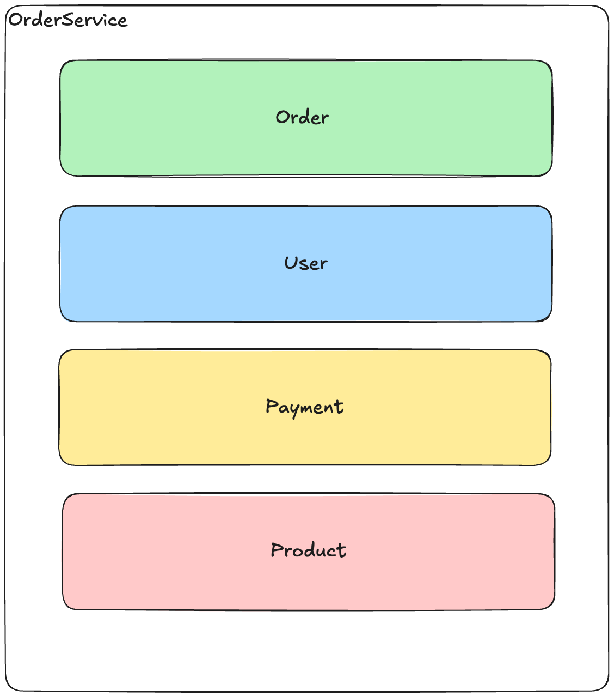

# MSA 환경에서 보상 트랜잭션, 사가 패턴 및 이벤트 기반 아키텍처 설계 보고서

## 서론

마이크로서비스 아키텍처(MSA)에서는 각 도메인이 독립적인 배포 단위와 데이터 저장소를 가지게 됩니다.  
이로 인해 기존 모놀리식 애플리케이션에서 사용하던 단일 ACID 트랜잭션 범위로 전체 비즈니스 로직을 관리하기 어렵게 되며,  
분산 트랜잭션을 효과적으로 처리하기 위해 **보상 트랜잭션**과 **사가(Saga) 패턴**, 그리고 **이벤트 기반 아키텍처**가 필요하게 됩니다.

## 기존 트랜잭션의 한계

- **단일 트랜잭션의 원자성 보장 불가**
  MSA 환경에서는 각 서비스가 분리된 DB를 가질 수 있고, 이에 따라서 단일 DB로 관리되던 때와는 달리




## 분산 트랜잭션 처리의 과제

### 분산 트랜잭션 문제점

- **단일 ACID 트랜잭션 불가:**  
  각 서비스가 자체 DB를 관리하므로 전체 도메인을 아우르는 단일 트랜잭션을 적용할 수 없습니다.


- **2PC(2-Phase Commit)의 한계:**  
  네트워크 지연, 장애, 자원 잠금 등으로 인해 2PC를 사용하면 시스템 가용성이 떨어지고 복잡성이 증가합니다.

### 2.2. 최종적 일관성 (Eventual Consistency)

- **최종적 일관성:**  
  각 서비스는 로컬 트랜잭션 내에서 강한 일관성을 유지하되, 전체 시스템은 시간이 지나면서 일관된 상태로 수렴합니다.

- **비동기 이벤트 전달:**  
  서비스 간 상태 변경은 이벤트 메시징 시스템(Kafka, RabbitMQ 등)을 통해 비동기적으로 전달되어, 단기적 불일치를 허용하되 최종적으로 동기화합니다.

## 3. 사가 패턴 및 보상 트랜잭션

사가 패턴은 분산 트랜잭션을 여러 개의 **로컬 트랜잭션**으로 분리하고, 각 단계에서 발생하는 실패에 대해 **보상 트랜잭션**을 실행하는 방식입니다.

### 3.1. 오케스트레이션 기반 사가 패턴

중앙의 **Saga 오케스트레이터**가 각 단계를 제어하며 순차적으로 로컬 트랜잭션을 실행합니다.  
실패 발생 시 오케스트레이터가 보상 트랜잭션을 호출하여 이전 상태로 복구합니다.

### 3.2. 코레오그래피 기반 사가 패턴

각 서비스가 자신의 로컬 트랜잭션을 완료한 후 이벤트를 발행하고, 다른 서비스가 이를 구독하여 다음 단계를 진행하는 방식입니다.  
보상 트랜잭션 역시 각 서비스가 별도로 이벤트를 통해 호출합니다.

### 3.3. 보상 트랜잭션의 역할

- **실패 복구:**  
  각 서비스는 자신의 로컬 트랜잭션에 대해 보상 로직을 구현합니다. 예를 들어, 결제 실패 시 주문 취소, 재고 복구 등이 이에 해당합니다.

- **최종적 일관성 달성:**  
  보상 트랜잭션을 통해 실패한 단계의 영향을 복구하면, 전체 시스템은 최종적으로 일관된 상태에 도달합니다.

---

## 4. 이벤트 기반 아키텍처

이벤트 기반 아키텍처는 서비스 간 비동기 통신을 통해 상태 변경 이벤트를 전달하여, 각 서비스가 독립적으로 처리되도록 합니다.

### 4.1. 주요 구성 요소

- **이벤트 메시징 시스템:**  
  Kafka, RabbitMQ, Redisson 등의 도구를 활용하여 이벤트를 발행하고 구독합니다.

- **이벤트 소싱:**  
  각 서비스의 상태 변경 내역을 이벤트 로그로 기록하여, 필요 시 재처리하거나 복구할 수 있습니다.

- **비동기 처리:**  
  서비스 간 API 호출 대신 이벤트를 통해 통신함으로써, 네트워크 장애에 따른 영향을 최소화하고 확장성을 확보합니다.

### 4.2. 최종적 일관성 구현

- **이벤트 발행:**  
  각 서비스는 자신의 로컬 트랜잭션이 완료되면 관련 이벤트(예: `OrderCreated`, `PaymentSuccess`, `PaymentFailed`, `InventoryDecreased` 등)를 발행합니다.

- **이벤트 구독 및 처리:**  
  다른 서비스는 이 이벤트들을 구독하여 후속 작업을 진행하거나, 문제가 발생할 경우 보상 트랜잭션을 실행합니다.

---

## 5. 설계 적용 예시 – 코드 예제

아래는 오케스트레이션 방식의 사가 패턴을 간단한 코드로 구현한 예제입니다.  
각 서비스는 Spring Boot 기반으로 로컬 트랜잭션을 수행하며, `ApplicationEventPublisher`를 통해 이벤트를 발행하고 `@EventListener`로 이벤트를 구독합니다.

### 5.1. Saga 오케스트레이터 코드 예제

```java
// 이벤트 객체 정의
public class OrderCreated {
	private final Order order;
}

public class PaymentSuccess {
	private final Order order;

	public PaymentSuccessfulEvent(Order order) {
		this.order = order;
	}

	public Order getOrder() {
		return order;
	}
}

public class PaymentFailedEvent {
	private final Order order;

	public PaymentFailedEvent(Order order) {
		this.order = order;
	}

	public Order getOrder() {
		return order;
	}
}
```

```java
// Saga Orchestrator 서비스
@Service
public class OrderSagaOrchestrator {

	private final OrderService orderService;
	private final PaymentService paymentService;
	private final InventoryService inventoryService;
	private final ApplicationEventPublisher publisher;

	public OrderSagaOrchestrator(OrderService orderService,
		PaymentService paymentService,
		InventoryService inventoryService,
		ApplicationEventPublisher publisher) {
		this.orderService = orderService;
		this.paymentService = paymentService;
		this.inventoryService = inventoryService;
		this.publisher = publisher;
	}

	// 주문 생성 요청 처리
	public void processOrder(Order order) {
		Order createdOrder = orderService.createOrder(order);
		// 주문 생성 후 이벤트 발행
		publisher.publishEvent(new OrderCreatedEvent(createdOrder));
	}

	// 주문 생성 이벤트 수신 후 결제 처리
	@EventListener
	public void handleOrderCreated(OrderCreatedEvent event) {
		Order order = event.getOrder();
		PaymentResult paymentResult = paymentService.processPayment(order);
		if (paymentResult.isSuccess()) {
			publisher.publishEvent(new PaymentSuccessfulEvent(order));
		} else {
			publisher.publishEvent(new PaymentFailedEvent(order));
		}
	}

	// 결제 성공 이벤트 수신 후 재고 차감 처리
	@EventListener
	public void handlePaymentSuccessful(PaymentSuccessfulEvent event) {
		Order order = event.getOrder();
		InventoryResult inventoryResult = inventoryService.decreaseInventory(order);
		if (!inventoryResult.isSuccess()) {
			// 재고 차감 실패 보상: 주문 취소 처리
			orderService.cancelOrder(order.getId());
		}
		// 모든 단계 성공 시 후속 이벤트 (예: 통계 업데이트 등) 발행 가능
	}

	// 결제 실패 이벤트 수신 시 주문 보상 처리
	@EventListener
	public void handlePaymentFailed(PaymentFailedEvent event) {
		Order order = event.getOrder();
		// 결제 실패 보상: 주문 취소 처리
		orderService.cancelOrder(order.getId());
	}
}
```

### 5.2. 각 서비스의 로컬 트랜잭션 및 보상 로직 (예시)

```java

@Service
public class PaymentService {

	// 결제 처리 로직
	public PaymentResult processPayment(Order order) {
		// 결제 시도: 성공하면 true, 실패하면 false 반환
		boolean success = ...; // 실제 결제 처리 로직 구현
		return new PaymentResult(success);
	}
}

@Service
public class InventoryService {

	// 재고 차감 로직
	public InventoryResult decreaseInventory(Order order) {
		// 재고 차감 시도: 성공하면 true, 실패하면 false 반환
		boolean success = ...; // 실제 재고 감소 로직 구현
		return new InventoryResult(success);
	}
}
```

*각 서비스는 로컬 트랜잭션 내에서 자신의 데이터베이스 작업을 처리하며, 실패 발생 시 보상 트랜잭션(예, 주문 취소, 재고 복구)을 별도로 호출합니다.*

---

## 6. 결론

MSA 환경에서는 각 도메인이 독립적으로 운영되므로, 전체 비즈니스 로직을 하나의 트랜잭션으로 묶는 것이 어렵습니다.  
이를 해결하기 위해 **사가 패턴**을 적용하여 여러 로컬 트랜잭션과 보상 트랜잭션으로 분리하고,  
**이벤트 기반 아키텍처**를 통해 서비스 간 상태 변경을 비동기적으로 전달하여 최종적 일관성을 확보합니다.

- **오케스트레이션 방식**은 중앙 조정자를 통해 각 단계의 성공/실패를 관리하며 보상 트랜잭션을 실행합니다.
- **코레오그래피 방식**은 각 서비스가 이벤트를 주고받으며 독립적으로 후속 처리를 수행합니다.
