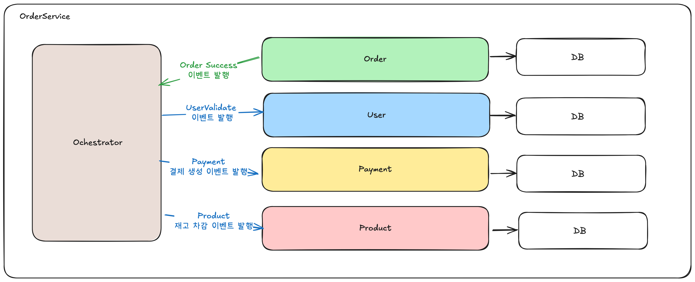

# MSA 환경에서 보상 트랜잭션, 사가 패턴 및 이벤트 기반 아키텍처 설계

## 개요

마이크로서비스 아키텍처(MSA)에서는 각 도메인이 독립적인 배포 단위와 데이터베이스를 가지게 됩니다.  
이로 인해 기존 모놀리식 애플리케이션에서 사용하던 단일 트랜잭션으로는 원자성을 보장할 수 없어 전체 비즈니스 로직을 관리하기 어렵게 되며,  
트랜잭션을 효과적으로 처리하기 위해 **보상 트랜잭션**과 **사가(Saga) 패턴**, 더 나아가서는 **이벤트 기반 아키텍처**가 필요하게 됩니다.

## 기존 트랜잭션의 한계

- **단일 트랜잭션의 원자성 보장 불가**
  MSA 환경에서는 각 서비스가 분리된 DB를 가질 수 있고, 이에 따라서 단일 DB로 관리되던 때와는 달리 전체 도메인을 아우르는 단일 트랜잭션을 적용하기 어렵습니다.
  따라서 트랜잭션의 원자성을 보장하기 어렵습니다. 아래 간단한 예제를 통해서 살펴보겠습니다.

  
  기존 OrderService 는 Order, User, Payment, Product 간의 협력으로 이루어져있고.
  Order 를 생성하고 User 를 확인한 뒤 Payment 를 진행하고 Product 의 재고를 감소시키는 로직을 가지고 있습니다.
  
  간단하게 로직으로 표현하자면 다음과 같습니다.
  ```java
  @Transactional
  public void order() {
    orderGenerator.generate();
    userValidator.validate();
    paymentProcessor.process();
    productStockModifier.decrease();
  }
  ```
  그림으로 간단히 표현해보겠습니다
    

  각 로직은 분리되어있지만, 하나의 트랜잭션으로 묶여있기 때문에, 하나의 로직이 실패하면 모든 로직이 롤백됩니다.

  이제 MSA 환경으로 전환된 경우를 살펴보겠습니다. 이때 각 도메인 별로 별도의 데이터베이스를 가지게 됩니다. 
  그리고 각 도메인이 각각의 시스템에서 동작하기 때문에 하나의 트랜잭션에서 로직을 처리할 수 없습니다.

  

  그러면 MSA 환경에서는 어떻게 일관성을 보장할까요? 일반적으로 두가지 방식이 존재합니다. 하나는 2PC(2-Phase Commit) 방식이고, 다른 하나는 사가 패턴을 사용하는 방식입니다.
  이제 각각 두가지 방식에 대해서 알아보겠습니다.

## 2PC(2-Phase Commit)

2PC 는 분산 환경에서 트랜잭션을 처리하기 위한 방법 중 하나로, 트랜잭션의 일관성을 강하게 보장하기 위해서 사용됩니다.
2PC 방식은 다음과 같은 두가지 특징을 가집니다.

1. 트랜잭션을 관리하는 주체가 존재한다.(Coordinator)
2. 트랜잭션을 처리하기 위해 두 단계를 거친다. 그리고 각 단계는 준비 단계, 커밋 단계 로 나뉩니다.

이제 2PC 를 사용하는 경우의 OrderService 로직에 대해서 살펴보겠습니다.

1. **준비 단계(Prepare)**

    준비단계에서 Coordinator 는 각 서비스에게 질의를 내림으로서 상태를 판단합니다. 해당 상태가 커밋이 가능한 상태인지 아닌지 모두 확인하는 과정을 거치게 됩니다.
    
    이때 각 서비스별로 확인이 되었다고 해서 바로 커밋되는 것은 아닙니다. 모든 서비스가 준비되었다는 응답이 왔을 때 까지 Coordinator 는 대기하게 됩니다.

  

2. **커밋 단계(Commit)**

    이제 준비단계에서 확인된 응답에 따라 한개의 서비스라도 정상적으로 처리되지 않았다면 Coordinator 는 모든 서비스에 Rollback 을 전송합니다.
    모든 서비스가 정상적으로 처리되었다면 Coordinator 는 모든 서비스에게 Commit 을 전송합니다.
    이때 각각의 행위들은 동시에 처리되는 것이 아니라 따로따로 처리되며 Coordinator 는 일관성을 위해 모든 작업이 완료될때까지 트랜잭션을 유지하게됩니다.

  

2PC 는 강한 일관성을 보장하기 위해 사용되지만, 네트워크 지연, 장애, 자원 잠금 등으로 인해 시스템 가용성이 떨어지고 복잡성이 증가합니다.
따라서, MSA 환경에서는 2PC 의 사용보다는 다른 방식을 사용하는 것이 일반적입니다.

## 사가 패턴(Saga)

사가 패턴은 MSA 환경에서 트랜잭션을 처리하기 위한 방법 중 하나로, 전체 트랜잭션을 여러 개의 로컬 트랜잭션으로 분리하고, 각 단계에서 발생하는 실패에 대해 보상 트랜잭션을 실행하는 방식입니다.
사가 패턴은 2PC 방식의 단점을 보완하고 일관성을 지키기 위해 다음과 같은 방법을 사용합니다.

1. 이벤트 방식의 처리
    2PC 에서 Coordinator 를 통해 트랜잭션을 강하게 결합했다면, 사가 패턴에서는 이를 각 로컬 트랜잭션으로 분리하고, 로컬 트랜잭션의 완료 시 이벤트를 발생시키는 방식으로 처리합니다.
2. 보상 트랜잭션
    2PC 에서 강하게 결합된 트랜잭션을 Coordinator 가 확인 후 모든 트랜잭션을 커밋, 롤백 시켰던것과는 달리 사가 패턴에서는 각 로컬 트랜잭션의 실패에 대해 보상 트랜잭션을 실행하는 방식으로 처리합니다.

그렇다면 보상 트랜잭션은 무엇일까요?

### 보상 트랜잭션

보상 트랜잭션은 실제 트랜잭션을 사용해서 롤백을 시키는 것이 아니라, 비즈니스적 로직을 활용해서 해당 행위를 취소하는 것을 의미합니다.
예를 들면 OrderService 를 처리할 때 최종 단게인 Product 에서 재고 차감에 실패했다고 가정하는 경우, 생성된 Order 를 DELETE 를 통해서 삭제하거나, 소프트 딜리트 등을 이용해서 삭제하고
Payment 등 이미 발생한 결제에 대해서는 PG사에 결제 취소 요청을 보내는 등의 행위를 의미합니다.

따라서, 실제로 트랜잭션이 롤백되는 것은 아니지만, 마치 롤백된 것과 동일하게 처리할 수 있습니다.

이제 사가 패턴의 방식들에 대해서 알아보겠습니다. 사가 패턴은 일반적으로 두가지의 방식이 있습니다.
Choreographed Saga, 다른 하나는 Orchestration Saga 입니다. 이제 각각에 대해서 알아보겠습니다.
  
### Choreographed Saga

Choreographed Saga 는 각 서비스가 이벤트를 발생시키고, 해당 이벤트의 관리 주체는 Message Queue(MQ) 가 담당합니다.
그리고 해당 MQ를 각 서비스가 구독/발행을 통해 이벤트를 처리합니다. Choreographed Saga 에서는 OrderService 를 다음과 같이 처리됩니다.


OrderSuccess 라는 오더 생성 성공의 이벤트가 발생했을때 각각의 행위들이 발생하고, 이를 순차적 혹은 동시에 처리하는 방식으로 진행가능합니다.
그리고 최종적 일관성 유지를 위해 앞에서 설명한 보상 트랜잭션을 사용하는데, 만약 실패할 경우에는 다음과 같이 처리됩니다.


OrderSuccess 라는 이벤트를 처리 중 ProductService 에서 재고 차감에 실패했다고 가정하면,
ProductService 에서 OrderFailed 이라는 이벤트를 발생시키고, 이를 구독하는 각 서비스에서는 해당 이벤트를 보상 트랜잭션으로 처리하게 됩니다.

Choreographed Saga 는 각 서비스가 이벤트를 발생시키고, 해당 이벤트를 구독하는 방식으로 처리하는 방식입니다.
그리고, 각 이벤트를 관리하는 주체는 MQ 이며, 최종적 일관성을 유지하기 위해 보상 트랜잭션을 사용합니다. 
이때 서비스는 어떤 이벤트를 처리할 지에 대해서 인식하고 있어야하며, 이로 인해 서비스간의 결합도가 높아질 수 있습니다.

### Orchestration Saga

Orchestration Saga 는 각 서비스가 이벤트를 발생시키는 것이 아닌, 중앙에서 이벤트를 관리하는 주체가 존재합니다. 이를 Ochestrator 라고 합니다.
Orchestrator 는 각 서비스에게 요청을 보내고, 해당 요청에 대한 응답을 받아서 처리하는 방식입니다.
Choreographed Saga 와 달리 각 서비스에서는 이벤트를 알 수 없고 오로지 Orchestrator 에게 요청을 받아서 처리합니다.
Orchestration Saga 에서는 OrderService 를 다음과 같이 처리합니다.



Orchestrator 는 각 서비스에게 요청을 보내고, 해당 요청에 대한 응답을 받아서 처리합니다.
이때 각 서비스에 발행하는 이벤트는 각 도메인 별로 알맞는 이벤트를 발생시키기 때문에 서비스는 더이상 다른 서비스에 의존할 필요가 없습니다.
롤백이 발생할 경우에도 각 서비스에 해당하는 이벤트를 통해 롤백 시킵니다.


Orchestration Saga 는 각 서비스가 이벤트를 발생시키는 것이 아닌, 중앙에서 이벤트를 관리하는 주체가 존재합니다.
이를 Ochestrator 라고 합니다. Orchestrator 는 각 서비스에게 요청을 보내고, 해당 요청에 대한 응답을 받아서 처리하는 방식입니다.
Choreographed Saga 와 달리 각 서비스에서는 다른 서비스의 이벤트를 알 수 없고 오로지 Orchestrator 에게 요청을 받아서 처리합니다.

## E-커머스 프로젝트에 적용하기

그럼 현재의 프로젝트에서 어떤 방식을 적용하는 것이 가장 좋을지에 대해서 생각해보아야합니다.
2PC 의 경우 MSA 환경에서 사용하기에는 복잡성이 높고, 가용성이 떨어지는 단점이 있습니다. 그리고 MSA 는 보통 대량 트래픽을 처리하기 위해서 도입되는데 2PC 는 대량 트래픽에 취약한 단점이 있습니다.

그럼 각 사가 패턴 중 어떤것을 선택해야할까요?
우선 Choreographed Saga 는 각 서비스가 이벤트를 발생시키고, 해당 이벤트를 구독하는 방식으로 처리하는 방식입니다. 따라서 서비스별로 이벤트를 서로 알고 있어야하는 문제가 있습니다.
결합도는 상승하지만, 현재 프로젝트가 그렇게 큰 규모가 아니므로 적합도가 높다고 판단할 수 있습니다.
Orchestration Saga 는 중앙에서 이벤트를 관리하는 주체가 존재하며, 각 서비스는 중앙에서 요청을 받아서 처리하는 방식입니다.
그렇기에 Orchestrator 의 구현 복잡도가 매우 높으며 장애가 발생하는 경우 모든 시스템에 장애가 발생하는 단일 장애 지점(SPOF)이 될 수 있습니다.
물론 Choreographed Saga 역시 MQ 가 SPOF 가 되지만, MQ 의 다양한 장애 방지 정책이나, 복구 정책 등을 통해서 이를 해결할 수 있습니다.
하지만, Orchestrator 의 경우에는 이러한 장애 복구 방식 역시 직접 구현해야한다는 점에서 구현 난이도가 매우 상승합니다.

따라서 현재의 프로젝트에는 Choreographed Saga 가 적합하다고 판단할 수 있습니다.

그러면 어떻게 구현할 수 있을까요? 현재는 각 서비스별로 완전히 분리되어있지 않고 같은 DB 를 사용하기 때문에 Spring Event 를 활용해서 간단한 구현 예제를 확인해보겠습니다.

```java

public class OrderService {

  private final OrderGenerator orderGenerator;
  private final OrderRemover orderRemover;
  private final UserValidator userValidator;
  private final ApplicationEventPublisher publisher;

  @Transactional
  public void order() {
    // 1. 주문 생성
    Order order = orderGenerator.generate();
    // 2. 사용자 검증
    userValidator.validate(order.getUserId());
    // 3. 주문 생성 완료 이벤트 발행 (결제 처리 후속 작업 트리거)
    publisher.publishEvent(new OrderCreatedEvent(order));
  }
  
  @EventListener
  public void onPaymentFailed(PaymentFailedEvent event) {
    Order order = event.getOrder();
    // 결제 실패 시 주문 롤백
    orderRemover.remove(order);
  }

}

public class PaymentService {

  private final PaymentProcessor paymentProcessor;
  private final ApplicationEventPublisher publisher;

  @EventListener
  public void onOrderCreated(OrderCreatedEvent event) {
    Order order = event.getOrder();
    boolean success = paymentProcessor.process(order);
    if (success) {
      // 결제 성공 이벤트 발행
      publisher.publishEvent(new PaymentProcessedEvent(order));
    } else {
      // 결제 실패 이벤트 발행
      publisher.publishEvent(new PaymentFailedEvent(order));
    }
  }
}

public class ProductStockService {

  private final ProductStockModifier productStockModifier;

  @EventListener
  public void onPaymentProcessed(PaymentProcessedEvent event) {
    Order order = event.getOrder();
    // 결제 성공 후 재고 차감
    productStockModifier.decrease(order);
  }

  @EventListener
  public void onPaymentFailed(PaymentFailedEvent event) {
    Order order = event.getOrder();
    // 결제 실패 시 재고 롤백
    productStockModifier.increase(order);
  }

}


```

## 결론

MSA 환경에서는 기존 트랜잭션의 한계로 인해 일관성 있는 처리가 어렵기 때문에, 2PC나 사가 패턴등의 도입이 필요합니다.
2PC 의 경우에는 DB의 부하가 많이 발생하고 이로인해 대량 트래픽등의 처리에 어렵다는 단점이 있어 MSA 에 적합하다고 말하기는 어렵습니다.

사가 패턴은 Orchestration Saga 와 Choreographed Saga 로 나뉘며, 각각의 장단점이 존재합니다.
Orchestration Saga 는 중앙에서 이벤트를 관리하는 주체가 존재하며, 각 서비스는 중앙에서 요청을 받아서 처리하는 방식입니다. 
그렇기에 각 서비스별로 Event 의 결합이 생기지 않는다는 장점이 있습니다.
하지만 Orchestrator 가 SPOF 가 될 확률이 높고 구현이 매우 복잡해질 수 있습니다.

Choreographed Saga 는 각 서비스가 이벤트를 발생시키고, 해당 이벤트를 MQ에서 구독하는 방식으로 처리하는 방식입니다.
따라서 서비스별로 이벤트를 서로 알고 있어야하는 문제가 있습니다.
하지만, MQ 가 이벤트의 중심이 되기 때문에 이를 구현할 필요가 없고 장애 복구등에도 조금 더 안전한 장점이 있습니다. 또한, 구현의 복잡도 역시 Orchestration Saga 보다는 낮습니다.

따라서, 현재의 프로젝트에는 **Choreographed Saga** 가 적합하다고 판단되며, Spring Event 를 활용해서 간단한 구현을 확인해보았습니다.
