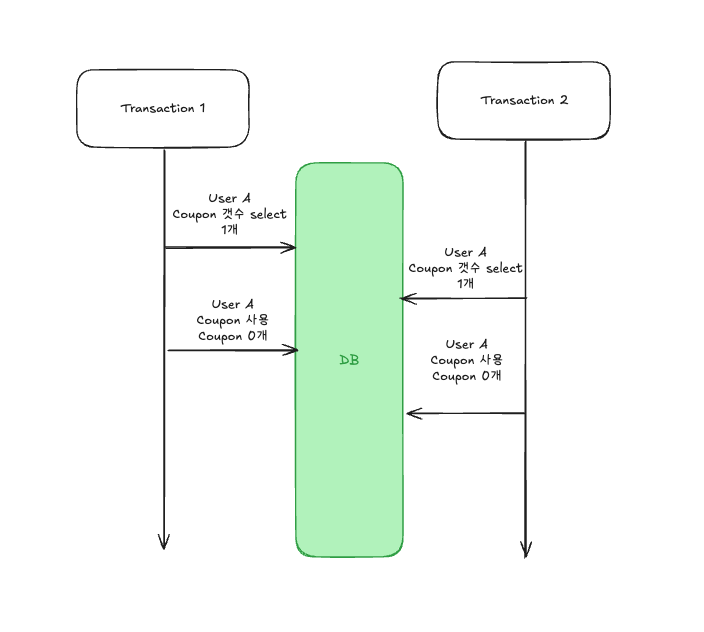

# 동시성 문제의 이해

## 동시성 문제란?

- 동시성 문제는 두 개 이상의 프로세스 또는 스레드가 동일한 리소스(예: 데이터베이스, 메모리)에 동시에 접근할 때 발생하는 문제입니다. 이런 문제는 데이터의 불일치를 유발할 수 있습니다.
- e-커머스 시나리오에서 발생할 수 있는 동시성 문제로 설명하자면, 쿠폰을 발행할때 트랜잭션이 동시에 시작되었다고 가정할 경우 쿠폰은 1개지만 확인-행동 하는 과정에서 시간 차이가 있어 실제로 2개의 쿠폰이 사용될
  수 있습니다.



## e-커머스 시나리오에서의 동시성 문제

1. 쿠폰 발행 과정에서의 동시성 문제
    - 쿠폰 발행시에도 발행의 최대 갯수가 제한되어 있기 때문에 동시성 문제가 발생할 수 있습니다.
    - 예를 들어 User A 가 동시에 쿠폰을 발행 요청하는 경우 남아있는 쿠폰의 갯수가 1개 이더라도 2개 혹은 그 이상이 발행 될 수 있습니다.
2. 쿠폰 사용시에서의 동시성 문제
    - 쿠폰 사용 시에서도 사용할 수 있는 쿠폰의 갯수가 제한되어있기 때문에 동시성 문제가 발생할 수 있습니다.
    - 예를 들어 User A 가 쿠폰을 사용하는 경우 사용가능한 쿠폰의 갯수가 1개이더라도 동시에 2개 이상의 요청이 발생하는 경우 2개 이상의 쿠폰을 사용하게 될 수 있습니다.
3. 재고 차감시에서의 동시성 문제
    - 현재 재고를 추가하는 로직은 없기 때문에, 재고 차감시에만 동시성 문제가 발생할 수 있습니다.
    - 예를 들어 User A 가 동시에 재고를 차감하는 경우(구매) 남아있는 재고가 1개 이더라도 2개 혹은 그 이상의 재고가 차감될 수 있습니다.
4. 잔고의 사용, 추가시의 동시성 문제
    - 잔고를 사용하거나 차감할때도 동시성 문제가 발생할 수 있습니다.
    - User A 가 잔고를 차감할 때(구매) 동시에 요청하기 되면 남아있는 잔고가 1000원이더라도 동시에 2건 이상 1000원에 대한 요청이 오는 경우 확인-실행사이의 텀으로 인해 중복으로 차감될 수
      있습니다.
    - user A 가 잔고를 추가할 때도 마찬가지로 동시성 문제가 발생할 수 있습니다. 잔고에 1000원을 동시에 2건 추가하였지만, 확인하는 시점의 잔고가 만약 1000원이었다면, 충전을 두번하였음에도
      불구하고 충전은 1회만 실행될 수 있습니다.
    - 잔고를 동시에 추가-차감하는 경우에도 동시성 문제가 발생할 수 있습니다.

# DB의 동시성 문제와 제어 방법

- DB에서의 동시성 제어 방법은 트랜잭션을 활용할 수도 있으며, Lock 을 활용할 수도 있습니다.
- 해당 문서에서는 트랜잭션을 활용하는 방법과 락을 활용하는 방법에 대해서 간단한 구현과 함께 설명하며 JPA 를 기반으로 어떻게 어플리케이션 레벨에서 구현하는지 설명합니다.

## 트랜잭션(Transaction) 을 이용한 동시성 문제 제어 방식

트랜잭션 레벨에서 동시성 문제를 제어하는 방식은 트랜잭션 격리 수준(Isolation Level)을 통해 이루어집니다. MySQL에서 제공하는 트랜잭션 격리 수준과 그에 따른 동시성 문제 제어 방법을 설명하고 구현
방식을 간단히 제시합니다.

### 트랜잭션 격리 수준과 특성

1. **READ UNCOMMITTED**
    - **특징:**
        - 다른 트랜잭션이 아직 커밋하지 않은 데이터를 읽을 수 있습니다.
        - 동시성은 높지만, Dirty Read, Non-Repeatable Read, Phantom Read 문제가 발생할 수 있습니다.
    - **장점:** 높은 동시성.
    - **단점:** 데이터 정합성이 매우 낮습니다.
    - **예시 구현:**
      ```java
       @Transactional(isolation = Isolation.READ_UNCOMMITTED)
       public void processTransaction() {
       // 비즈니스 로직 처리
       }
      ```
    - **사용 시점:** 테스트나 로그 분석 등 데이터 정합성이 중요하지 않은 경우.

---

2. **READ COMMITTED (기본 격리 수준 in MySQL)**
    - **특징:**
        - 다른 트랜잭션이 커밋한 데이터만 읽을 수 있습니다.
        - Dirty Read 방지, Non-Repeatable Read와 Phantom Read는 발생할 수 있습니다.
    - **장점:** Dirty Read를 방지하여 데이터 정합성을 어느 정도 보장.
    - **단점:** 반복적인 읽기에서 데이터가 변경될 수 있음.
    - **예시 구현:**
      ```java
       @Transactional(isolation = Isolation.READ_COMMITTED)
       public void processTransaction() {
       // 비즈니스 로직 처리
       }
      ```
    - **사용 시점:** 데이터 변경 빈도가 높은 환경.

---

3. **REPEATABLE READ (MySQL 기본 격리 수준)**
    - **특징:**
        - 트랜잭션이 시작된 이후 동일 데이터를 반복 조회 시 동일한 값을 반환합니다.
        - Dirty Read와 Non-Repeatable Read 방지.
        - Phantom Read는 여전히 발생 가능.
        - MySQL 의 기본 트랜잭션 관리 레벨이다.
    - **장점:** 트랜잭션 동안 데이터 일관성이 보장.
    - **단점:** Phantom Read 방지 위해 추가 조치 필요
    - **예시 구현:**
      ```java
       @Transactional(isolation = Isolation.REPEATABLE_READ)
       public void processTransaction() {
       // 비즈니스 로직 처리
       }
      ```
    - **사용 시점:** 대부분의 애플리케이션에서 데이터 정합성과 성능 간 균형.

---

4. **SERIALIZABLE**
    - **특징:**
        - 모든 트랜잭션을 순차적으로 실행하는 것처럼 동작합니다.
        - Dirty Read, Non-Repeatable Read, Phantom Read 완전 방지.
    - **장점:** 데이터 정합성 최상 보장.
    - **단점:** 동시성 크게 저하, 대기 시간이 길어질 수 있음.
    - **예시 구현:**
      ```java
       @Transactional(isolation = Isolation.SERIALIZABLE)
       public void processTransaction() {
       // 비즈니스 로직 처리
       }
      ```
    - **사용 시점:** 데이터 정합성이 최우선인 환경

---

### 동시성 문제와 트랜잭션 격리 수준의 관계

| 격리 수준            | Dirty Read | Non-Repeatable Read | Phantom Read |
|------------------|------------|---------------------|--------------|
| READ UNCOMMITTED | 가능         | 가능                  | 가능           |
| READ COMMITTED   | 불가능        | 가능                  | 가능           |
| REPEATABLE READ  | 불가능        | 불가능                 | 가능           |
| SERIALIZABLE     | 불가능        | 불가능                 | 불가능          |

## Lock 을 이용한 동시성 문제 제어 방식

- Lock은 데이터베이스 또는 애플리케이션에서 동시성 문제를 방지하기 위해 사용하는 기법입니다. 여러 트랜잭션이 동시에 동일한 데이터에 접근할 경우 발생할 수 있는 데이터 충돌이나 무결성 문제를 방지하는 데 중요한
  역할을 합니다. Lock은 크게 **낙관적 락**과 **비관적 락**으로 나눌 수 있습니다.

### 낙관적 락 (Optimistic Lock)

- 낙관적 락은 충돌이 드물 것이라고 가정하고 동작하는 락 메커니즘입니다. 데이터 수정 시점에 버전 정보를 통해 충돌 여부를 검증하며, JPA에서는 `@Version` 어노테이션을 통해 구현할 수 있습니다. 데이터
  수정 전후의 버전이 일치하지 않으면 예외를 발생시키고, 해당 트랜잭션은 재시도해야 합니다.
- 낙관적 락은 충돌-재시도를 통한 데이터 정합성을 보장하기 때문에, 순서의 보장이 어렵습니다.
-

**구현 방식:**
`@Version` 어노테이션을 엔티티 필드에 추가하면 JPA가 자동으로 낙관적 락을 관리합니다. 따라서 별도의 명시적 `@Lock` 설정 없이도 동작합니다. `LockModeType.NONE`은 낙관적 락과
결합하여 락 없이 데이터를 읽을 때 사용할 수 있습니다.

**JPA에서 제공하는 낙관적 락 종류:**

- **OPTIMISTIC:** 낙관적 락으로, `@Version` 필드를 활용해 데이터 충돌 여부를 검증합니다.
- 해당 옵션을 사용하지 않더라도 `@Version` 필드만 사용하여도 낙관적 락을 구현할 수 있습니다.

  **구현 예:**
  ```java
  @Lock(LockModeType.OPTIMISTIC)
  @Query("SELECT a FROM Account a WHERE a.id = :id")
  Optional<Account> findWithOptimisticLock(@Param("id") Long id);
  ```

- **OPTIMISTIC_FORCE_INCREMENT:** 낙관적 락을 사용하며, 읽기 시점에 버전을 강제로 증가시킵니다. 이는 쓰기 연산이 필요한 경우에 적합합니다.

  **구현 예:**
  ```java
  @Lock(LockModeType.OPTIMISTIC_FORCE_INCREMENT)
  @Query("SELECT a FROM Account a WHERE a.id = :id")
  Optional<Account> findWithOptimisticForceIncrement(@Param("id") Long id);
  ```

**장점:**

- 데이터베이스 레벨의 락을 사용하지 않아 성능이 우수합니다.
- 트랜잭션 충돌이 드문 환경에 적합합니다.
- 별도의 명시적 설정 없이 `@Version`만으로 관리가 가능합니다.
- spring-retry 등 재시도 가능한 라이브러리 혹은 프레임워크와 함께 구현한다면 최종적 데이터의 정합성을 맞출 확률이 증가합니다.

**단점:**

- 충돌 발생 시 재시도가 필요하며, 재시도가 많아지면 성능이 저하될 수 있습니다.
- 충돌이 빈번한 환경에서는 부적합합니다.

**데드락 발생 가능성:** 거의 없음.

---

### 비관적 락 (Pessimistic Lock)

비관적 락은 데이터 충돌이 빈번할 것으로 가정하고 데이터를 수정하거나 읽기 전에 데이터베이스에 락을 거는 방식입니다. JPA에서는 `LockModeType`을 사용하여 구현할 수 있습니다.

**JPA에서 제공하는 락 종류:**

- **PESSIMISTIC_READ:** 비관적 읽기 락(S-Lock)을 설정합니다. 다른 트랜잭션이 해당 데이터를 읽을 수는 있지만 수정은 불가능합니다.

  **구현 예:**
  ```java
  @Lock(LockModeType.PESSIMISTIC_READ)
  @Query("SELECT a FROM Account a WHERE a.id = :id")
  Optional<Account> findWithPessimisticRead(@Param("id") Long id);
  ```

- **PESSIMISTIC_WRITE:** 비관적 쓰기 락(X-Lock)을 설정합니다. 다른 트랜잭션이 해당 데이터를 읽거나 수정할 수 없습니다.

  **구현 예:**
  ```java
  @Lock(LockModeType.PESSIMISTIC_WRITE)
  @Query("SELECT a FROM Account a WHERE a.id = :id")
  Optional<Account> findWithPessimisticWrite(@Param("id") Long id);
  ```

- **PESSIMISTIC_FORCE_INCREMENT:** 비관적 쓰기 락과 함께 버전 번호를 강제로 증가시킵니다.

  **구현 예:**
  ```java
  @Lock(LockModeType.PESSIMISTIC_FORCE_INCREMENT)
  @Query("SELECT a FROM Account a WHERE a.id = :id")
  Optional<Account> findWithPessimisticForceIncrement(@Param("id") Long id);
  ```

**장점:**

- 데이터 충돌을 확실히 방지할 수 있습니다.
- 데이터 무결성을 강하게 보장해야 하는 상황에 적합합니다.

**단점:**

- 데이터베이스 락으로 인해 성능에 부하가 발생할 수 있고 DB 의 커넥션이 말라서 장애를 발생시킬 수 있습니다.
- 락이 오래 유지되면 데드락 가능성이 높아집니다.

**데드락 발생 가능성:** 중간에서 높음. 대표적인 데드락 상황:

- 두 트랜잭션이 서로 다른 리소스에 락을 건 후 상대방이 가진 락을 기다리는 경우.
- 트랜잭션 간 락 순서가 일관되지 않아 순환 대기가 발생.
- 대량 쓰기 작업 중 특정 락이 장시간 유지되어 대기열이 형성.

---

### 네임드 락 (Named Lock) - 분산 락

네임드 락은 MySQL의 `GET_LOCK` 및 `RELEASE_LOCK` 함수를 활용하여 애플리케이션 레벨에서 특정 리소스를 이름으로 잠그는 방식입니다. 트랜잭션 단위로 커스텀 리소스 락을 구현할 때 유용합니다.

**구현 예:**

```java

@Query(value = "SELECT GET_LOCK(:lockName, 10)", nativeQuery = true)
void acquireLock(@Param("lockName") String lockName);

@Query(value = "SELECT RELEASE_LOCK(:lockName)", nativeQuery = true)
void releaseLock(@Param("lockName") String lockName);
```

**장점:**

- 특정 리소스를 잠그는 데 매우 유연합니다.
- 상대적으로 간단하게 구현 가능합니다.
- 분산 환경에서 MySQL 을 락을 위한 도구로 활용 가능합니다.

**단점:**

- 락 해제가 제대로 관리되지 않으면 문제가 발생할 수 있습니다.

**데드락 발생 가능성:** 중간. 주요 원인:

- `GET_LOCK` 호출 후 `RELEASE_LOCK` 호출 실패.
- 동일 네임드 락을 여러 트랜잭션이 대기하며 교착 상태 발생.
- 타임아웃 설정이 부적절하여 장기 대기열 생성.

# 레디스(Redis) 를 활용한 분산 락

- 분산 락은 분산 시스템 환경에서 여러 프로세스가 공유 리소스에 동시에 접근하지 못하도록 제어하는 메커니즘입니다. 이를 통해 데이터 정합성을 유지하고 경쟁 상태를 방지할 수 있습니다.
- Redis는 가벼운 메모리 기반 데이터 저장소로 높은 성능과 낮은 레이턴시를 제공하며, 이를 이용해 분산 락을 구현할 수 있습니다.
- Redis 분산 락은 SETNX(Set if Not Exists)와 TTL(Time-To-Live)을 기반으로 분산 환경에서 동시성 제어와 데이터 무결성을 보장하기 위해 사용됩니다.
- Redis 의 클라이언트는 대표적으로 Lettuce 와 Redisson 을 사용하며, 두 클라이언트는 다른 방식으로 분산락을 구현합니다.

## Lettuce 를 이용한 분산 락

- Spring Boot 에서 Lettuce 를 사용하기 위해서는 일반적으로 spring-boot-starter-data-redis 을 사용하면 간단하게 구현할 수 있습니다.
- spring-boot-starter-data-redis 에서는 Jedis 도 기본 드라이버로 제공하고 있지만, 해당 설명에서는 생략합니다.
- Lettuce 는 기본 구현으로 분산 락을 제공하고 있지 않기 때문에 락을 제공하기 위해서는 추가적인 구현이 필요합니다.

```java
// Lettuce 를 이용한 간단한 LockRepository 의 구현
@Component
@RequiredArgsConstructor
public class RedisLockRepository {
	private final RedisTemplate<String, String> redisTemplate;

	public Boolean lock(Long key) {
		return redisTemplate
			.opsForValue()
			.setIfAbsent(generated(key), "lock", Duration.ofMillis(1000));
	}

	public Boolean unlock(Long key) {
		return redisTemplate.delete(generated(key));
	}
}

```

- 이때, Lettuce 를 이용한 락을 사용하기 위해서는 락의 해제를 지속적으로 확인하는 **스핀 락** 의 형태로 구성되어야합니다.

```java

@Component
@Slf4j
@RequiredArgsConstructor
public class LettuceLockService {
	private final RedisLockRepository redisLockRepository;

	public void businessLogic(long key) {
		try {
			while (redisLockRepository.lock(key) == false) {
				//waiting
			}
			//비즈니스 로직
		} finally {
			redisLockRepository.unlock(key);
		}

	}

}
```

- 스핀 락의 이러한 지속적 확인 과정은 네트워크 I/O 를 지속적으로 발생시키고 이는 어플리케이션 및 레디스의 부하를 발생 시킵니다.

## Redisson 을 이용한 분산 락

- Redisson 은 Redis 를 사용하기 위한 자바 클라이언트 라이브러리 중 하나로 다양한 고수준의 추상화를 제공하고 있습니다.
- 특히 분산락에서 Redisson 은 RedLock 알고리즘을 이용한 Lock 획득 및 해제를 Pub-Sub 구조로 실행합니다.
- Lock 을 획득하고 있는 쪽에서 메세지를 보내 대기하는 쪽에서 Lock 을 얻도록 함으로써 부하가 감소됩니다.
- 고수준의 Retry, Timeout 등의 API 를 지원하기 때문에 훨씬 간단하게 분산락을 구현가능합니다.
- Spring boot 에서는 redisson-spring-boot-starter 을 이용해서 구현합니다.

```java

@Component
@Slf4j
@RequiredArgsConstructor
public class RedissonLockService {
	private final RedissonClient redissonClient;

	public void businessLogic(long key) {
		RLock lock = redissonClient.getLock(key);

		if (lock.tryLock(5, 10, TimeUnit.SECONDS)) {
			try {
				//비즈니스 로직
			} finally {
				lock.unlock();
			}
		} else {
		}
	}

}
```

- 사용자의 추가적인 구현이 필요없이 redisson-spring-boot-starter 의 API 로만 분산 락을 이용 가능하다.
- Pub-Sub 구조를 사용하기 때문에 lettuce 의 스핀 락 구조보다도 훨씬 부하가 적다

